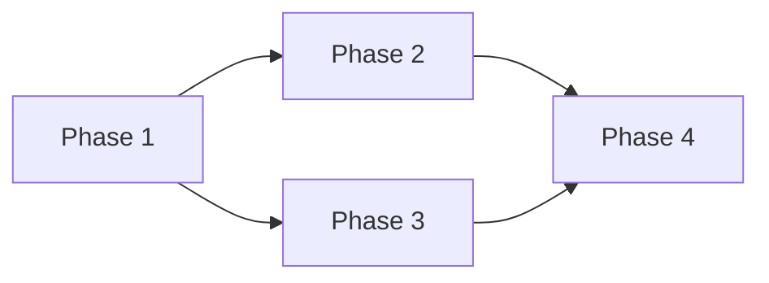

## CRITICAL RULE: ORCHESTRATOR MUST NOT TAKE OVER AGENT WORK

**The orchestrator (main agent running /implement) is ONLY a coordinator.**

**ABSOLUTELY FORBIDDEN:**

- If planner agent fails → DO NOT create the plan yourself
- If coder agent fails → DO NOT implement the phase yourself
- If agent returns error → DO NOT read files and do the work manually
- If agent times out → DO NOT continue where it left off
- If plan file missing → DO NOT use "conversation context" as substitute
- If agent shows summary but file doesn't exist → DO NOT proceed

**MANDATORY on ANY agent failure:**

1. Send ntfy notification with error details
2. Report failure to user clearly
3. STOP completely
4. Wait for user to investigate and retry

**The orchestrator's job is to:**

- Launch agents
- Collect and present agent outputs
- Track progress in plan files
- Send notifications
- Ask user for decisions

**The orchestrator must NEVER:**

- Research the codebase
- Read source files to understand implementation
- Write or edit code
- Make implementation decisions

---

## Notifications

**MANDATORY**: Send ntfy notifications at key points.

```bash
# Send notification (uses NTFY_TOPIC from .actrc if set, otherwise holler-dev)
curl -s -X POST "https://ntfy.sh/${NTFY_TOPIC:-holler-dev}" \
  -H "Title: Holler Implementation" \
  -H "Priority: default" \
  -d "Your message here"
```

Use this at these points:

- **Phase 2**: Plan ready for approval
- **After each phase**: Phase complete with summary
- **On error**: Build/test failures requiring attention
- **Phase 4**: All phases complete

---

## Step 0: Parse Arguments

**Parse `$ARGUMENTS` for issue/instruction and mode flag:**

```
Examples:
- "2" → Issue #2, mode not specified (ask later)
- "2 --auto" → Issue #2, autonomous mode
- "add admin auth" → Direct instruction, mode not specified
- "add admin auth --auto" → Direct instruction, autonomous mode
```

**If no arguments provided**: Extract issue number from current branch name.

```bash
# Get current branch name
git branch --show-current
```

Branches follow the pattern: `<issue-number>-<description>` (e.g., `2-build-feedback-board`).

**Store the mode:**

- `--auto` flag present → `EXECUTION_MODE=autonomous`
- No flag → `EXECUTION_MODE=ask` (will ask after plan approval)

---

## Workflow Overview

This command follows a **persistent plan-then-execute** workflow:

1. **Check for Existing Plans**: Look for in-progress implementation plans
2. **Planning Phase**: If no existing plan, create a detailed plan and save it
3. **Review Phase**: Present the plan to the user for approval + mode selection
4. **Execution Phase**: Implement phases using coder agents (sequential or parallel)

---

## Phase 0: Check for Existing Implementation Plans

**MANDATORY FIRST STEP**: Before creating a new plan, check for existing plans.

### Step 1: Check for uncommitted/unstaged plan files

```bash
# Check for any plan files (staged, unstaged, or untracked)
git status --porcelain .claude/plans/

# List all plan files with their status
ls -la .claude/plans/*.md 2>/dev/null || echo "No plan files found"
```

### Step 2: Check for recently committed plans

```bash
# Find recently committed plan files (last 10 commits)
git log --oneline --name-only -10 -- .claude/plans/ | grep -E '\.md$' | head -5
```

### Step 3: If existing plan found

1. **Read the plan file** to understand current state
2. **Check the Progress Tracking section** for completed/pending phases
3. **Resume from the next incomplete phase**
4. **Skip to Phase 3 (Execution)** if plan was already approved

### Step 4: If no existing plan or plan is complete

Proceed to Phase 1 to create a new plan.

---

## Phase 1: Planning

Use the `implementation-planner` agent to analyze the request and create an implementation plan.

The planner will:

- Parse the input (GitHub issue number or direct instruction)
- Research the codebase (HTMX, Hono, D1, Cloudflare Workers)
- Design the solution architecture
- **Break down into numbered phases** for multi-step implementations
- **Identify independent phases** that can run in parallel
- **Save the plan to `.claude/plans/`**

**Invoke the planner**:

```
Task(
  subagent_type: "implementation-planner",
  prompt: "Create an implementation plan for: $ARGUMENTS

  If this is a GitHub issue number, fetch it first with gh issue view.
  Research the relevant parts of the codebase thoroughly.

  IMPORTANT:
  - Break the implementation into numbered PHASES (Phase 1, Phase 2, etc.)
  - Each phase should be a logical, independently testable unit
  - Mark phases that can run in PARALLEL (no dependencies between them)
  - Save the plan to .claude/plans/<issue-number>-<short-name>.md
  - Include a Progress Tracking section at the top of the plan
  - Include a Phase Dependencies section showing which phases depend on others

  Produce a complete, actionable implementation plan."
)
```

### MANDATORY: Verify Plan File Exists

**After the planner agent completes, you MUST verify the plan file was actually created:**

```bash
# Check if plan file exists
ls -la .claude/plans/*.md 2>/dev/null | tail -5
```

**If no new plan file exists:**

- The planner agent FAILED even if it showed a summary
- A summary in conversation is NOT a saved plan
- DO NOT proceed to Phase 2
- Treat as agent failure (see below)

**Common failure pattern:**

```
Agent shows: "Plan saved to: .claude/plans/xyz.md"
But file doesn't exist
Orchestrator tries to use "conversation context" instead
```

**This is FORBIDDEN.** No plan file = agent failed = STOP.

### CRITICAL: Handle Planner Agent Failure

**If the planner agent fails, returns an error, or produces no plan file:**

1. **DO NOT take over the planning work yourself**
2. **DO NOT research the codebase and create a plan manually**
3. **Send ntfy notification about the failure**:

```bash
curl -s -X POST "https://ntfy.sh/${NTFY_TOPIC:-holler-dev}" \
  -H "Title: Planner Agent Failed" \
  -H "Priority: urgent" \
  -H "Tags: x" \
  -d "Implementation planner agent failed. Manual intervention required. Error: <error details>"
```

4. **Report the error to the user and STOP**:

```
Implementation planner agent failed.

Error: <error details>

The orchestrator will NOT take over planning.
Please investigate the issue and retry with /implement.
```

5. **Do NOT proceed to Phase 2**

---

## Phase 2: User Approval + Mode Selection

After receiving the plan from the planner agent:

1. **Show the saved plan file path**
2. **Present the plan summary** to the user
3. **Highlight the phases** and any parallel opportunities
4. **Send ntfy notification** that plan is ready:

```bash
curl -s -X POST "https://ntfy.sh/${NTFY_TOPIC:-holler-dev}" \
  -H "Title: Plan Ready for Review" \
  -H "Priority: high" \
  -H "Tags: clipboard" \
  -d "Implementation plan complete. Review and approve to proceed."
```

5. **Ask for approval AND mode selection** (if `--auto` was not specified):

```typescript
AskUserQuestion({
  questions: [
    {
      question: 'The implementation plan is ready. How would you like to proceed?',
      header: 'Execution',
      options: [
        {
          label: 'Autonomous',
          description: 'Execute all phases automatically, notify after each, stop only on errors',
        },
        {
          label: 'Classical',
          description: 'Ask for confirmation after each phase before continuing',
        },
        {
          label: 'Review plan',
          description: 'I want to review the plan in detail before deciding',
        },
        {
          label: 'Cancel',
          description: 'Do not proceed with implementation',
        },
      ],
      multiSelect: false,
    },
  ],
})
```

**If `--auto` was specified**: Skip mode question, proceed directly with autonomous mode.

**IMPORTANT**: Do NOT proceed to implementation without explicit user approval.

---

## Phase 3: Execution

Execute the plan using **coder agents** - one per phase for fresh context.

### Execution Mode: Autonomous

- Execute all phases without stopping for user input
- Send ntfy notification after each phase
- Collect all summaries and concerns
- Stop ONLY on blocking issues (build/test failure)
- Present full report at the end

### Execution Mode: Classical

- Execute one phase at a time
- Present summary and ask for confirmation after each
- User can pause, modify, or continue

### Parallel Phase Detection

Before starting execution, analyze the plan for independent phases:

```markdown
Example Phase Dependencies:

- Phase 1: Create service (no dependencies)
- Phase 2: Create component (depends on Phase 1)
- Phase 3: Add tests for service (depends on Phase 1)
- Phase 4: Add tests for component (depends on Phase 2)

Parallel opportunities:

- Phase 2 and Phase 3 can run in parallel (both only depend on Phase 1)
```

### Execution Loop

For each phase (or parallel group):

#### Step 1: Update Plan File - Mark Phase as In Progress

```markdown
## Progress Tracking

| Phase   | Status      | Started    | Completed  |
| ------- | ----------- | ---------- | ---------- |
| Phase 1 | ✅ Complete | 2026-01-28 | 2026-01-28 |
| Phase 2 | In Progress | 2026-01-28 | -          |
| Phase 3 | Pending     | -          | -          |
```

#### Step 2: Launch Coder Agent(s)

**For sequential phases:**

```typescript
Task(
  subagent_type: "holler-coder",
  prompt: `Implement Phase X from the plan at .claude/plans/<plan-file>.md

  Read the plan file first, then implement ONLY Phase X.
  Follow all project patterns from CLAUDE.md.
  Run build and tests after implementation.

  Return a structured summary in the required format.`
)
```

**For parallel phases (e.g., Phase 2 and Phase 3 are independent):**

```typescript
// Launch both in parallel
Task(
  subagent_type: "holler-coder",
  run_in_background: true,
  prompt: "Implement Phase 2 from .claude/plans/<plan-file>.md ..."
)

Task(
  subagent_type: "holler-coder",
  run_in_background: true,
  prompt: "Implement Phase 3 from .claude/plans/<plan-file>.md ..."
)

// Wait for both to complete
TaskOutput(task_id: "<phase-2-agent-id>", block: true)
TaskOutput(task_id: "<phase-3-agent-id>", block: true)
```

### CRITICAL: Handle Coder Agent Failure

**If a coder agent fails, returns an error, or produces no output:**

1. **DO NOT take over the implementation work yourself**
2. **DO NOT implement the phase manually**
3. **DO NOT read files and make changes on behalf of the failed agent**
4. **Send ntfy notification about the failure**:

```bash
curl -s -X POST "https://ntfy.sh/${NTFY_TOPIC:-holler-dev}" \
  -H "Title: Coder Agent Failed - Phase X" \
  -H "Priority: urgent" \
  -H "Tags: x" \
  -d "Coder agent failed on Phase X. Manual intervention required. Error: <error details>"
```

5. **Report the error to the user and STOP**:

```
Coder agent failed on Phase X.

Error: <error details>

The orchestrator will NOT take over implementation.
Please investigate the issue and retry with /implement to resume from this phase.
```

6. **Do NOT proceed to the next phase**
7. **Do NOT attempt to fix or complete the failed phase**

#### Step 3: Process Coder Agent Response

Parse the structured summary from the coder agent:

```markdown
## Phase X Summary

### Files Changed

- **Created**: `path/to/new/file.ts`
- **Modified**: `path/to/existing/file.ts`

### Key Changes

- Created `ClassName` with methods: `methodA()`, `methodB()`
- Added `functionName()` to handle X

### Decisions Made

- Simplified X because Y was overcomplicated
- Used alternative approach for Z

### Verification

- Build: ✅ Pass | Fail (reason)
- Tests: ✅ Pass | Fail (reason)
```

#### Step 4: Orchestrator Review

Review the coder agent's work and flag concerns:

**Check for:**

- Deviation from plan (compare changes to plan steps)
- Missing tests (if phase should include tests)
- Missing error handling (for user-facing features)
- Build/test failures

#### Step 5: Verify Commit

The coder agent commits changes after successful verification. Check the summary for:

```markdown
### Commit

- ✅ Committed: `abc1234` | Not committed (verification failed)
```

**If not committed**: The coder agent encountered verification failures. Review the summary and address issues before proceeding.

#### Step 6: Send ntfy Notification

```bash
curl -s -X POST "https://ntfy.sh/${NTFY_TOPIC:-holler-dev}" \
  -H "Title: Phase X Complete" \
  -H "Priority: default" \
  -H "Tags: white_check_mark" \
  -d "Phase X complete. Files: X created, Y modified. Concerns: Z"
```

#### Step 7: Handle Mode-Specific Flow

**Autonomous Mode:**

- If build/tests pass → Continue to next phase
- If build/tests fail → STOP and notify user
- Collect concerns for final report

**Classical Mode:**

```typescript
AskUserQuestion({
  questions: [
    {
      question: 'Phase X is complete. What would you like to do?',
      header: 'Next step',
      options: [
        {
          label: 'Continue',
          description: 'Proceed with the next phase',
        },
        {
          label: 'Address concerns',
          description: 'Fix flagged issues before continuing',
        },
        {
          label: 'Pause',
          description: 'Stop here, can resume later with /implement',
        },
      ],
      multiSelect: false,
    },
  ],
})
```

#### Step 8: Update Plan File - Mark Phase Complete

```markdown
## Progress Tracking

| Phase   | Status      | Started    | Completed  |
| ------- | ----------- | ---------- | ---------- |
| Phase 1 | ✅ Complete | 2026-01-28 | 2026-01-28 |
| Phase 2 | ✅ Complete | 2026-01-28 | 2026-01-28 |
| Phase 3 | Pending     | -          | -          |

### Phase 2 Completion Notes

- Files created: src/components/...
- Files modified: src/index.tsx
- Decisions: Simplified approach
- Concerns flagged: None
```

---

## Phase 4: Final Completion

After ALL phases are complete:

### Autonomous Mode Final Report

Present comprehensive summary:

```markdown
## Implementation Complete

### Summary

- Total phases: X
- Parallel executions: Y
- Total files created: Z
- Total files modified: W

### Phase Summaries

[Collected summaries from all phases]

### All Concerns Flagged

- Phase 1: None
- Phase 2: Consider adding rate limiting
- Phase 3: Edge case with empty search

### Commits Created

- abc1234: feat(#2): implement phase 1 - D1 schema and queries
- def5678: feat(#2): implement phase 2 - HTMX routes and components
- ghi9012: feat(#2): implement phase 3 - admin and Turnstile

### Next Steps

- [ ] Address flagged concerns if desired
- [ ] Push to remote: git push
- [ ] Create PR: gh pr create
- [ ] Or squash commits: git reset --soft HEAD~3 && git commit
```

### Send Final ntfy Notification

```bash
curl -s -X POST "https://ntfy.sh/${NTFY_TOPIC:-holler-dev}" \
  -H "Title: Implementation Complete" \
  -H "Priority: high" \
  -H "Tags: tada" \
  -d "All X phases complete! Y concerns flagged. Ready for review."
```

### Update Documentation

Update any affected documentation:

- `CLAUDE.md` if architectural patterns changed
- Plan file with final notes

### Mark Plan as Complete

```markdown
## Progress Tracking

| Phase   | Status      | Started    | Completed  |
| ------- | ----------- | ---------- | ---------- |
| Phase 1 | ✅ Complete | 2026-01-28 | 2026-01-28 |
| Phase 2 | ✅ Complete | 2026-01-28 | 2026-01-28 |
| Phase 3 | ✅ Complete | 2026-01-28 | 2026-01-28 |

## Implementation Complete: 2026-01-28

### Final Summary

- Execution mode: Autonomous
- Total files created: X
- Total files modified: Y
- Tests: All passing
- Concerns addressed: [list]
- Concerns deferred: [list]
```

---

## Error Handling

### Build Failure

1. STOP execution immediately
2. Send ntfy notification with error details
3. Report to user with failure context
4. Do NOT continue to next phase

```bash
curl -s -X POST "https://ntfy.sh/${NTFY_TOPIC:-holler-dev}" \
  -H "Title: Build Failed - Phase X" \
  -H "Priority: urgent" \
  -H "Tags: x" \
  -d "Build failed in Phase X. Manual intervention required."
```

### Test Failure

1. STOP execution immediately
2. Report failing tests
3. Ask user how to proceed (even in autonomous mode)

### Coder Agent Timeout

1. Check agent status with TaskOutput
2. If stuck, report to user
3. Suggest manual intervention or retry

---

## Plan File Format

Plans must be saved in `.claude/plans/` with this format:

**Filename**: `<issue-number>-<short-kebab-name>.md`

**Template**:

````markdown
# Implementation Plan: [Feature Name]

**Issue**: #XXX (if applicable)
**Created**: YYYY-MM-DD
**Status**: Planning | Approved | In Progress | Complete

## Progress Tracking

| Phase   | Status  | Started | Completed |
| ------- | ------- | ------- | --------- |
| Phase 1 | Pending | -       | -         |
| Phase 2 | Pending | -       | -         |

## Phase Dependencies


````

- Phase 1: No dependencies (can start immediately)
- Phase 2: Depends on Phase 1
- Phase 3: Depends on Phase 1 (can run parallel with Phase 2)
- Phase 4: Depends on Phase 2 and Phase 3

## Summary

Brief 2-3 sentence overview.

## Requirements

- Requirement 1
- Requirement 2

## Architecture Overview

- **New files**: list
- **Modified files**: list

## Phase 1: [Phase Title]

### Objective

What this phase accomplishes.

### Steps

1. Step 1
2. Step 2

### Files

- Create: `path/to/file`
- Modify: `path/to/existing`

### Verification

- [ ] Build passes
- [ ] Tests pass (if applicable)

## Phase 2: [Phase Title]

[Same structure as Phase 1]

---

## Completion Notes

[Filled in as phases complete]

```

---

## Quick Reference

| Phase    | Action                          | Tool/Agent                        |
| -------- | ------------------------------- | --------------------------------- |
| Check    | Look for existing plans         | Bash (git status, ls)             |
| Plan     | Create and save plan            | Task (implementation-planner)     |
| Review   | Present plan, get approval/mode | AskUserQuestion + ntfy            |
| Execute  | Implement phases                | Task (holler-coder) per phase     |
| Parallel | Run independent phases together | Multiple Task with run_in_background |
| Review   | Check coder output for concerns | Orchestrator logic                |
| Notify   | Alert user                      | Bash (curl to ntfy.sh)            |
| Complete | Final report and cleanup        | Direct output                     |
```
