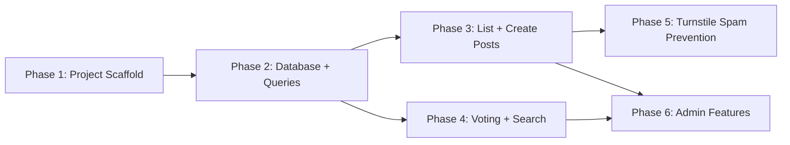

# Implementation Plan: Build Holler - HTMX Feedback Board on Cloudflare Workers

**Issue**: #2
**Created**: 2026-01-28
**Status**: In Progress

## Progress Tracking

| Phase   | Status  | Started | Completed |
| ------- | ------- | ------- | --------- |
| Phase 1 | ✅ Complete | 2026-01-28 | 2026-01-28 |
| Phase 2 | ✅ Complete | 2026-01-28 | 2026-01-28 |
| Phase 3 | ✅ Complete | 2026-01-28 | 2026-01-28 |
| Phase 4 | ✅ Complete | 2026-01-28 | 2026-01-28 |
| Phase 5 | ✅ Complete | 2026-01-28 | 2026-01-28 |
| Phase 6 | In Progress | 2026-01-28 | -         |

## Phase Dependencies



- Phase 1: No dependencies (start immediately)
- Phase 2: Depends on Phase 1
- Phase 3: Depends on Phase 2
- Phase 4: Depends on Phase 2 (CAN RUN PARALLEL with Phase 3)
- Phase 5: Depends on Phase 3
- Phase 6: Depends on Phase 3 AND Phase 4

## Summary

Build a complete HTMX-powered feedback board running on Cloudflare Workers with Hono JSX for server-side rendering, D1 (SQLite) for persistence with FTS5 full-text search, cookie-based voting, Turnstile spam prevention, and simple token-based admin authentication. The project starts from a blank repository with only `package.json` (husky) and `CLAUDE.md` in place.

## Requirements

- Submit feedback (title, description, optional email)
- Upvote posts (one vote per visitor, cookie-based)
- List posts sorted by votes/date with status filtering
- Full-text search via FTS5
- Turnstile captcha on submission
- Progressive enhancement (works without JS)
- Simple admin auth for status updates and post deletion

## Technical Research Findings

- **Hono JSX**: Use `FC` type from `hono/jsx`, `c.html()` for rendering, `tsconfig.json` with `"jsx": "react-jsx"` and `"jsxImportSource": "hono/jsx"`
- **D1 FTS5**: Use lowercase `fts5` (case-sensitive on D1). Virtual tables created in migrations. Triggers keep FTS in sync with source table.
- **Static assets**: Use `[assets]` with `directory = "./public"` in `wrangler.toml` -- files served directly by Cloudflare edge
- **Turnstile**: POST to `https://challenges.cloudflare.com/turnstile/v0/siteverify` with `secret` and `response` fields. Tokens expire after 300 seconds, single-use.
- **Bindings**: Type bindings as generics on `Hono<{ Bindings: Bindings }>`, access via `c.env.DB`, `c.env.TURNSTILE_SECRET`

## Architecture Overview

- **New files**:
  - `src/index.tsx` -- Worker entry point + Hono routes
  - `src/db.ts` -- D1 query functions
  - `src/components/Layout.tsx` -- HTML shell with head, HTMX, CSS
  - `src/components/PostCard.tsx` -- Single post display
  - `src/components/PostForm.tsx` -- Feedback submission form
  - `src/components/VoteButton.tsx` -- Vote button with HTMX swap
  - `src/schema.sql` -- Reference schema (informational)
  - `migrations/0001_initial.sql` -- D1 migration with FTS5
  - `public/styles.css` -- Minimal CSS
  - `wrangler.toml` -- Workers + D1 + assets config
  - `tsconfig.json` -- TypeScript + JSX config
- **Modified files**:
  - `package.json` -- Add hono, wrangler, types, scripts

---

## Phase 1: Project Scaffold + Configuration

### Objective

Set up the complete project skeleton: package.json dependencies, wrangler.toml with D1 binding and static assets, tsconfig.json for Hono JSX, and a minimal "hello world" Hono worker that builds and runs.

### Steps

#### Step 1.1: Update package.json

**Files**: `package.json`

**Description**: Add Hono as a production dependency, wrangler and @cloudflare/workers-types as dev dependencies, and configure npm scripts.

**Code approach**:

```json
{
  "name": "holler",
  "version": "0.1.0",
  "description": "Lightweight feedback board. HTMX + Cloudflare Workers + D1.",
  "type": "module",
  "scripts": {
    "dev": "wrangler dev",
    "build": "wrangler deploy --dry-run --outdir dist",
    "deploy": "wrangler deploy",
    "prepare": "husky"
  },
  "dependencies": {
    "hono": "^4"
  },
  "devDependencies": {
    "@cloudflare/workers-types": "^4",
    "husky": "^9.1.7",
    "wrangler": "^3"
  }
}
```

**Pitfalls to avoid**:
- Must set `"type": "module"` for ESM compatibility with Cloudflare Workers
- Use `wrangler deploy --dry-run --outdir dist` for the build script so it validates without deploying

#### Step 1.2: Create wrangler.toml

**Files**: `wrangler.toml`

**Description**: Configure the Worker name, entry point, D1 database binding, and static asset serving.

**Code approach**:

```toml
name = "holler"
main = "src/index.tsx"
compatibility_date = "2025-01-01"

[assets]
directory = "./public"

[[d1_databases]]
binding = "DB"
database_name = "holler-db"
database_id = "local"
migrations_dir = "migrations"
```

**Pitfalls to avoid**:
- The `database_id = "local"` is a placeholder; wrangler dev creates a local SQLite file automatically. The real ID is set after `wrangler d1 create` in production.
- The `main` should point to `src/index.tsx` (not `.ts`) since we use JSX.

#### Step 1.3: Create tsconfig.json

**Files**: `tsconfig.json`

**Description**: Configure TypeScript for Hono JSX and Cloudflare Workers types.

**Code approach**:

```json
{
  "compilerOptions": {
    "target": "ESNext",
    "module": "ESNext",
    "moduleResolution": "bundler",
    "jsx": "react-jsx",
    "jsxImportSource": "hono/jsx",
    "strict": true,
    "esModuleInterop": true,
    "skipLibCheck": true,
    "forceConsistentCasingInFileNames": true,
    "types": ["@cloudflare/workers-types"]
  },
  "include": ["src/**/*.ts", "src/**/*.tsx"]
}
```

**Pitfalls to avoid**:
- `"jsxImportSource": "hono/jsx"` is required -- without it, JSX won't compile
- `"moduleResolution": "bundler"` works best with wrangler's esbuild bundling

#### Step 1.4: Create minimal entry point

**Files**: `src/index.tsx`

**Description**: Create a minimal Hono app that returns a hello world page, proving the JSX + Workers stack works.

**Code approach**:

```tsx
import { Hono } from 'hono'

type Bindings = {
  DB: D1Database
  TURNSTILE_SECRET: string
  ADMIN_TOKEN: string
}

const app = new Hono<{ Bindings: Bindings }>()

app.get('/', (c) => {
  return c.html(
    <html>
      <head><title>Holler</title></head>
      <body><h1>Holler - Feedback Board</h1></body>
    </html>
  )
})

export default app
```

#### Step 1.5: Create public/styles.css placeholder

**Files**: `public/styles.css`

**Description**: Create an empty CSS file so the public directory exists for static asset serving.

**Code approach**:

```css
/* Holler styles */
```

#### Step 1.6: Install dependencies and verify build

**Description**: Run `npm install` and `npm run build` to confirm everything compiles.

### Verification

- [ ] `npm install` succeeds
- [ ] `npm run build` succeeds (compiles without errors)
- [ ] `npx wrangler dev --local` starts and serves the hello world page on localhost:8787

---

## Phase 2: Database Schema + Query Layer

### Objective

Create the D1 migration with posts table, votes table, and FTS5 virtual table with sync triggers. Build the `db.ts` query layer with all CRUD operations.

### Steps

#### Step 2.1: Create D1 migration

**Files**: `migrations/0001_initial.sql`

**Description**: Create the initial migration with the complete schema from the issue: posts table, votes table, FTS5 virtual table, and sync triggers.

**Code approach**:

```sql
-- Posts table
CREATE TABLE posts (
  id INTEGER PRIMARY KEY,
  title TEXT NOT NULL,
  description TEXT,
  email TEXT,
  votes INTEGER DEFAULT 0,
  status TEXT DEFAULT 'open',
  created_at DATETIME DEFAULT CURRENT_TIMESTAMP
);

-- Votes table (one vote per visitor per post)
CREATE TABLE votes (
  post_id INTEGER,
  visitor_id TEXT,
  PRIMARY KEY (post_id, visitor_id),
  FOREIGN KEY (post_id) REFERENCES posts(id) ON DELETE CASCADE
);

-- Full-text search with FTS5 (use lowercase 'fts5' -- case-sensitive on D1)
CREATE VIRTUAL TABLE posts_fts USING fts5(
  title,
  description,
  content='posts',
  content_rowid='id'
);

-- Triggers to keep FTS index in sync
CREATE TRIGGER posts_ai AFTER INSERT ON posts BEGIN
  INSERT INTO posts_fts(rowid, title, description)
  VALUES (new.id, new.title, new.description);
END;

CREATE TRIGGER posts_ad AFTER DELETE ON posts BEGIN
  INSERT INTO posts_fts(posts_fts, rowid, title, description)
  VALUES('delete', old.id, old.title, old.description);
END;

CREATE TRIGGER posts_au AFTER UPDATE ON posts BEGIN
  INSERT INTO posts_fts(posts_fts, rowid, title, description)
  VALUES('delete', old.id, old.title, old.description);
  INSERT INTO posts_fts(rowid, title, description)
  VALUES (new.id, new.title, new.description);
END;
```

**Pitfalls to avoid**:
- Must use lowercase `fts5` -- D1 is case-sensitive for this keyword (uppercase `FTS5` returns "not authorized")
- Add `ON DELETE CASCADE` to the votes foreign key so deleting a post cleans up votes
- The `content='posts'` and `content_rowid='id'` make the FTS table a "contentless" external content table that references the posts table

#### Step 2.2: Create database query layer

**Files**: `src/db.ts`

**Description**: Create typed query functions for all database operations. Each function takes a `D1Database` instance and returns typed results.

**Code approach**:

```typescript
export interface Post {
  id: number
  title: string
  description: string | null
  email: string | null
  votes: number
  status: string
  created_at: string
}

export type PostStatus = 'open' | 'planned' | 'in_progress' | 'done' | 'closed'

export type SortOption = 'votes' | 'newest' | 'oldest'

export async function listPosts(
  db: D1Database,
  options: {
    status?: string
    sort?: SortOption
    search?: string
  } = {}
): Promise<Post[]> {
  const { status, sort = 'votes', search } = options

  // If search query provided, use FTS5
  if (search) {
    const query = `
      SELECT p.* FROM posts p
      INNER JOIN posts_fts ON posts_fts.rowid = p.id
      WHERE posts_fts MATCH ?
      ${status ? 'AND p.status = ?' : ''}
      ORDER BY rank
    `
    const bindings: (string)[] = [search]
    if (status) bindings.push(status)
    const result = await db.prepare(query).bind(...bindings).all<Post>()
    return result.results
  }

  // Standard listing with optional status filter
  let orderClause: string
  switch (sort) {
    case 'newest': orderClause = 'p.created_at DESC'; break
    case 'oldest': orderClause = 'p.created_at ASC'; break
    default: orderClause = 'p.votes DESC, p.created_at DESC'; break
  }

  const query = `
    SELECT p.* FROM posts p
    ${status ? 'WHERE p.status = ?' : ''}
    ORDER BY ${orderClause}
  `
  const bindings: string[] = []
  if (status) bindings.push(status)
  const result = await db.prepare(query).bind(...bindings).all<Post>()
  return result.results
}

export async function getPost(db: D1Database, id: number): Promise<Post | null> {
  const result = await db.prepare('SELECT * FROM posts WHERE id = ?').bind(id).first<Post>()
  return result
}

export async function createPost(
  db: D1Database,
  data: { title: string; description?: string; email?: string }
): Promise<Post> {
  const result = await db
    .prepare('INSERT INTO posts (title, description, email) VALUES (?, ?, ?) RETURNING *')
    .bind(data.title, data.description || null, data.email || null)
    .first<Post>()
  return result!
}

export async function toggleVote(
  db: D1Database,
  postId: number,
  visitorId: string
): Promise<{ voted: boolean; votes: number }> {
  // Check if already voted
  const existing = await db
    .prepare('SELECT 1 FROM votes WHERE post_id = ? AND visitor_id = ?')
    .bind(postId, visitorId)
    .first()

  if (existing) {
    // Remove vote
    await db.prepare('DELETE FROM votes WHERE post_id = ? AND visitor_id = ?')
      .bind(postId, visitorId).run()
    await db.prepare('UPDATE posts SET votes = votes - 1 WHERE id = ?')
      .bind(postId).run()
  } else {
    // Add vote
    await db.prepare('INSERT INTO votes (post_id, visitor_id) VALUES (?, ?)')
      .bind(postId, visitorId).run()
    await db.prepare('UPDATE posts SET votes = votes + 1 WHERE id = ?')
      .bind(postId).run()
  }

  const post = await db.prepare('SELECT votes FROM posts WHERE id = ?')
    .bind(postId).first<{ votes: number }>()

  return { voted: !existing, votes: post!.votes }
}

export async function hasVoted(
  db: D1Database,
  postId: number,
  visitorId: string
): Promise<boolean> {
  const result = await db
    .prepare('SELECT 1 FROM votes WHERE post_id = ? AND visitor_id = ?')
    .bind(postId, visitorId)
    .first()
  return !!result
}

export async function updatePostStatus(
  db: D1Database,
  id: number,
  status: PostStatus
): Promise<Post | null> {
  const result = await db
    .prepare('UPDATE posts SET status = ? WHERE id = ? RETURNING *')
    .bind(status, id)
    .first<Post>()
  return result
}

export async function deletePost(db: D1Database, id: number): Promise<boolean> {
  const result = await db.prepare('DELETE FROM posts WHERE id = ?').bind(id).run()
  return result.meta.changes > 0
}
```

**Pitfalls to avoid**:
- Use `RETURNING *` to get the inserted/updated row back in one query
- FTS5 MATCH query returns results ranked by relevance (use `ORDER BY rank`)
- The `toggleVote` function must update both the `votes` table AND the denormalized `votes` count on `posts`
- Use parameterized queries everywhere -- never string-interpolate user input

### Verification

- [ ] `npm run build` succeeds
- [ ] Migration file is valid SQL
- [ ] All query functions have correct TypeScript types

---

## Phase 3: Core UI - List Posts + Create Post

### Objective

Build the Hono JSX components (Layout, PostCard, PostForm) and the routes for the home page (listing posts) and post creation. This phase delivers the core user experience: viewing and submitting feedback.

### Steps

#### Step 3.1: Create Layout component

**Files**: `src/components/Layout.tsx`

**Description**: The HTML shell wrapping all pages. Includes the `<head>` with HTMX script, CSS, and optional Turnstile script. Detects HTMX requests to return fragments vs full pages.

**Code approach**:

```tsx
import type { FC, PropsWithChildren } from 'hono/jsx'

type LayoutProps = PropsWithChildren<{
  title?: string
  includeTurnstile?: boolean
}>

export const Layout: FC<LayoutProps> = ({ title, includeTurnstile, children }) => {
  return (
    <html lang="en">
      <head>
        <meta charset="utf-8" />
        <meta name="viewport" content="width=device-width, initial-scale=1" />
        <title>{title ? `${title} - Holler` : 'Holler'}</title>
        <link rel="stylesheet" href="/styles.css" />
        <script src="https://unpkg.com/htmx.org@2.0.4" integrity="sha384-HGfztofotfshcF7+8n44JQL2oJmowVChPTg48S+jvZoztPfvwD79OC/LTtG6dMp+" crossorigin="anonymous"></script>
        {includeTurnstile && (
          <script src="https://challenges.cloudflare.com/turnstile/v0/api.js" async defer></script>
        )}
      </head>
      <body>
        <header>
          <a href="/">
            <h1>Holler</h1>
          </a>
          <p>Share your feedback and feature requests</p>
        </header>
        <main>
          {children}
        </main>
        <footer>
          <p>Powered by <a href="https://github.com/wassertim/holler">Holler</a></p>
        </footer>
      </body>
    </html>
  )
}
```

**Pitfalls to avoid**:
- Use a pinned, integrity-checked HTMX version for security
- The Turnstile script should only be included on pages with forms (`includeTurnstile` prop)
- Use `<meta charset="utf-8" />` self-closing for JSX compatibility

#### Step 3.2: Create PostCard component

**Files**: `src/components/PostCard.tsx`

**Description**: Renders a single feedback post with title, description, vote count, status badge, and relative timestamp.

**Code approach**:

```tsx
import type { FC } from 'hono/jsx'
import type { Post } from '../db'
import { VoteButton } from './VoteButton'

type PostCardProps = {
  post: Post
  voted: boolean
}

export const PostCard: FC<PostCardProps> = ({ post, voted }) => {
  const statusLabels: Record<string, string> = {
    open: 'Open',
    planned: 'Planned',
    in_progress: 'In Progress',
    done: 'Done',
    closed: 'Closed',
  }

  return (
    <article class="post-card">
      <VoteButton postId={post.id} votes={post.votes} voted={voted} />
      <div class="post-content">
        <h2 class="post-title">{post.title}</h2>
        {post.description && <p class="post-description">{post.description}</p>}
        <div class="post-meta">
          <span class={`status-badge status-${post.status}`}>
            {statusLabels[post.status] || post.status}
          </span>
          <time datetime={post.created_at}>{post.created_at}</time>
        </div>
      </div>
    </article>
  )
}
```

#### Step 3.3: Create PostForm component

**Files**: `src/components/PostForm.tsx`

**Description**: The feedback submission form with HTMX progressive enhancement. Works as a standard form submission (no-JS fallback) and as an HTMX-powered inline submission.

**Code approach**:

```tsx
import type { FC } from 'hono/jsx'

type PostFormProps = {
  turnstileSiteKey?: string
}

export const PostForm: FC<PostFormProps> = ({ turnstileSiteKey }) => {
  return (
    <form
      action="/posts"
      method="POST"
      hx-post="/posts"
      hx-target="#post-list"
      hx-swap="afterbegin"
      hx-on--after-request="if(event.detail.successful) this.reset()"
      class="post-form"
    >
      <div class="form-group">
        <label for="title">Title *</label>
        <input
          type="text"
          id="title"
          name="title"
          required
          maxlength="200"
          placeholder="What's your feedback or feature request?"
        />
      </div>
      <div class="form-group">
        <label for="description">Description</label>
        <textarea
          id="description"
          name="description"
          rows="3"
          maxlength="2000"
          placeholder="Add more details (optional)"
        ></textarea>
      </div>
      <div class="form-group">
        <label for="email">Email (optional)</label>
        <input
          type="email"
          id="email"
          name="email"
          placeholder="Get notified about updates"
        />
      </div>
      {turnstileSiteKey && (
        <div class="cf-turnstile" data-sitekey={turnstileSiteKey}></div>
      )}
      <button type="submit">Submit Feedback</button>
    </form>
  )
}
```

**Pitfalls to avoid**:
- The form must work as a standard POST (no-JS fallback) AND as an HTMX request
- `hx-on--after-request` resets the form after successful submission
- Turnstile widget is conditionally rendered only when siteKey is provided

#### Step 3.4: Create VoteButton component (placeholder)

**Files**: `src/components/VoteButton.tsx`

**Description**: A vote button that will be enhanced with HTMX in Phase 4. For now, renders a static form with POST action.

**Code approach**:

```tsx
import type { FC } from 'hono/jsx'

type VoteButtonProps = {
  postId: number
  votes: number
  voted: boolean
}

export const VoteButton: FC<VoteButtonProps> = ({ postId, votes, voted }) => {
  return (
    <form
      action={`/posts/${postId}/vote`}
      method="POST"
      hx-post={`/posts/${postId}/vote`}
      hx-swap="outerHTML"
      class="vote-form"
    >
      <button type="submit" class={`vote-button ${voted ? 'voted' : ''}`}>
        <span class="vote-arrow">{voted ? '\u25B2' : '\u25B3'}</span>
        <span class="vote-count">{votes}</span>
      </button>
    </form>
  )
}
```

#### Step 3.5: Build the home page route and post creation route

**Files**: `src/index.tsx`

**Description**: Replace the placeholder entry point with the full home page route (GET /) that lists posts, and the post creation route (POST /posts). Handle both HTMX fragment responses and full page responses.

**Code approach**:

```tsx
import { Hono } from 'hono'
import { getCookie, setCookie } from 'hono/cookie'
import { Layout } from './components/Layout'
import { PostCard } from './components/PostCard'
import { PostForm } from './components/PostForm'
import { listPosts, createPost, hasVoted } from './db'

type Bindings = {
  DB: D1Database
  TURNSTILE_SECRET: string
  TURNSTILE_SITE_KEY: string
  ADMIN_TOKEN: string
}

const app = new Hono<{ Bindings: Bindings }>()

// Helper: get or create a visitor ID from cookie
function getVisitorId(c: any): string {
  let id = getCookie(c, 'visitor_id')
  if (!id) {
    id = crypto.randomUUID()
    setCookie(c, 'visitor_id', id, {
      httpOnly: true,
      secure: true,
      sameSite: 'Lax',
      maxAge: 60 * 60 * 24 * 365, // 1 year
    })
  }
  return id
}

// Home page - list posts
app.get('/', async (c) => {
  const status = c.req.query('status')
  const sort = c.req.query('sort') as 'votes' | 'newest' | 'oldest' | undefined
  const search = c.req.query('q')
  const visitorId = getVisitorId(c)

  const posts = await listPosts(c.env.DB, { status, sort, search })

  // Check which posts this visitor has voted on
  const votedSet = new Set<number>()
  for (const post of posts) {
    if (await hasVoted(c.env.DB, post.id, visitorId)) {
      votedSet.add(post.id)
    }
  }

  const postListHtml = (
    <div id="post-list">
      {posts.length === 0 ? (
        <p class="empty-state">No feedback yet. Be the first to share!</p>
      ) : (
        posts.map((post) => (
          <PostCard post={post} voted={votedSet.has(post.id)} />
        ))
      )}
    </div>
  )

  // HTMX request: return fragment only
  if (c.req.header('HX-Request')) {
    return c.html(postListHtml)
  }

  // Full page request
  return c.html(
    <Layout includeTurnstile={!!c.env.TURNSTILE_SITE_KEY}>
      <PostForm turnstileSiteKey={c.env.TURNSTILE_SITE_KEY} />

      <section class="controls">
        <input
          type="search"
          name="q"
          placeholder="Search feedback..."
          hx-get="/"
          hx-trigger="keyup changed delay:300ms"
          hx-target="#post-list"
          hx-push-url="true"
          value={search || ''}
        />
        <select
          name="sort"
          hx-get="/"
          hx-trigger="change"
          hx-target="#post-list"
          hx-include="[name='q'],[name='status']"
        >
          <option value="votes" selected={sort === 'votes' || !sort}>Top Voted</option>
          <option value="newest" selected={sort === 'newest'}>Newest</option>
          <option value="oldest" selected={sort === 'oldest'}>Oldest</option>
        </select>
        <select
          name="status"
          hx-get="/"
          hx-trigger="change"
          hx-target="#post-list"
          hx-include="[name='q'],[name='sort']"
        >
          <option value="">All Statuses</option>
          <option value="open" selected={status === 'open'}>Open</option>
          <option value="planned" selected={status === 'planned'}>Planned</option>
          <option value="in_progress" selected={status === 'in_progress'}>In Progress</option>
          <option value="done" selected={status === 'done'}>Done</option>
          <option value="closed" selected={status === 'closed'}>Closed</option>
        </select>
      </section>

      {postListHtml}
    </Layout>
  )
})

// Create post
app.post('/posts', async (c) => {
  const body = await c.req.parseBody()
  const title = (body['title'] as string || '').trim()
  const description = (body['description'] as string || '').trim()
  const email = (body['email'] as string || '').trim()

  // Validate
  if (!title || title.length > 200) {
    return c.html(<p class="error">Title is required (max 200 characters)</p>, 400)
  }

  const post = await createPost(c.env.DB, {
    title,
    description: description || undefined,
    email: email || undefined,
  })

  // HTMX request: return new post card
  if (c.req.header('HX-Request')) {
    return c.html(<PostCard post={post} voted={false} />)
  }

  // No-JS fallback: redirect to home
  return c.redirect('/')
})

export default app
```

**Pitfalls to avoid**:
- Must check `c.req.header('HX-Request')` to differentiate HTMX requests from full page loads
- The `getVisitorId` helper uses a secure, httpOnly cookie for identifying voters
- Form data comes from `c.req.parseBody()` (not `c.req.json()`) since it is HTML form submission
- Search controls use `hx-include` to pass sibling input values along with the request

#### Step 3.6: Create public/styles.css

**Files**: `public/styles.css`

**Description**: Minimal, clean CSS for the feedback board. Focus on readability and usability, not visual flair.

**Code approach**:

```css
/* Reset and base */
*,
*::before,
*::after {
  box-sizing: border-box;
  margin: 0;
  padding: 0;
}

:root {
  --color-bg: #fafafa;
  --color-surface: #ffffff;
  --color-text: #1a1a1a;
  --color-text-muted: #666666;
  --color-primary: #2563eb;
  --color-primary-hover: #1d4ed8;
  --color-border: #e5e7eb;
  --color-voted: #2563eb;
  --radius: 8px;
}

body {
  font-family: -apple-system, BlinkMacSystemFont, "Segoe UI", Roboto, sans-serif;
  background: var(--color-bg);
  color: var(--color-text);
  line-height: 1.6;
  max-width: 720px;
  margin: 0 auto;
  padding: 2rem 1rem;
}

/* Header */
header {
  margin-bottom: 2rem;
}

header a {
  text-decoration: none;
  color: inherit;
}

header h1 {
  font-size: 1.5rem;
  margin-bottom: 0.25rem;
}

header p {
  color: var(--color-text-muted);
  font-size: 0.875rem;
}

/* Form */
.post-form {
  background: var(--color-surface);
  border: 1px solid var(--color-border);
  border-radius: var(--radius);
  padding: 1.5rem;
  margin-bottom: 1.5rem;
}

.form-group {
  margin-bottom: 1rem;
}

.form-group label {
  display: block;
  font-size: 0.875rem;
  font-weight: 500;
  margin-bottom: 0.25rem;
}

.form-group input,
.form-group textarea {
  width: 100%;
  padding: 0.5rem 0.75rem;
  border: 1px solid var(--color-border);
  border-radius: 4px;
  font-size: 0.875rem;
  font-family: inherit;
}

.form-group textarea {
  resize: vertical;
}

.post-form button[type="submit"] {
  background: var(--color-primary);
  color: white;
  border: none;
  padding: 0.5rem 1.25rem;
  border-radius: 4px;
  font-size: 0.875rem;
  cursor: pointer;
}

.post-form button[type="submit"]:hover {
  background: var(--color-primary-hover);
}

/* Controls */
.controls {
  display: flex;
  gap: 0.75rem;
  margin-bottom: 1.5rem;
  flex-wrap: wrap;
}

.controls input[type="search"] {
  flex: 1;
  min-width: 200px;
  padding: 0.5rem 0.75rem;
  border: 1px solid var(--color-border);
  border-radius: 4px;
  font-size: 0.875rem;
}

.controls select {
  padding: 0.5rem 0.75rem;
  border: 1px solid var(--color-border);
  border-radius: 4px;
  font-size: 0.875rem;
  background: var(--color-surface);
}

/* Post cards */
.post-card {
  display: flex;
  gap: 1rem;
  background: var(--color-surface);
  border: 1px solid var(--color-border);
  border-radius: var(--radius);
  padding: 1rem;
  margin-bottom: 0.75rem;
}

.post-content {
  flex: 1;
  min-width: 0;
}

.post-title {
  font-size: 1rem;
  font-weight: 600;
  margin-bottom: 0.25rem;
}

.post-description {
  font-size: 0.875rem;
  color: var(--color-text-muted);
  margin-bottom: 0.5rem;
}

.post-meta {
  display: flex;
  gap: 0.75rem;
  align-items: center;
  font-size: 0.75rem;
  color: var(--color-text-muted);
}

/* Status badges */
.status-badge {
  display: inline-block;
  padding: 0.125rem 0.5rem;
  border-radius: 999px;
  font-size: 0.7rem;
  font-weight: 500;
  text-transform: uppercase;
  letter-spacing: 0.025em;
}

.status-open { background: #dbeafe; color: #1e40af; }
.status-planned { background: #fef3c7; color: #92400e; }
.status-in_progress { background: #e0e7ff; color: #3730a3; }
.status-done { background: #d1fae5; color: #065f46; }
.status-closed { background: #f3f4f6; color: #6b7280; }

/* Vote button */
.vote-form {
  flex-shrink: 0;
}

.vote-button {
  display: flex;
  flex-direction: column;
  align-items: center;
  gap: 0.125rem;
  background: var(--color-surface);
  border: 1px solid var(--color-border);
  border-radius: var(--radius);
  padding: 0.5rem 0.75rem;
  cursor: pointer;
  min-width: 48px;
  font-size: 0.875rem;
  color: var(--color-text-muted);
  transition: border-color 0.15s, color 0.15s;
}

.vote-button:hover {
  border-color: var(--color-primary);
  color: var(--color-primary);
}

.vote-button.voted {
  border-color: var(--color-voted);
  color: var(--color-voted);
}

.vote-arrow {
  font-size: 1rem;
}

.vote-count {
  font-weight: 600;
}

/* Empty state */
.empty-state {
  text-align: center;
  color: var(--color-text-muted);
  padding: 3rem 1rem;
}

/* Error */
.error {
  color: #dc2626;
  font-size: 0.875rem;
  padding: 0.5rem;
}

/* Footer */
footer {
  margin-top: 3rem;
  padding-top: 1.5rem;
  border-top: 1px solid var(--color-border);
  text-align: center;
  font-size: 0.75rem;
  color: var(--color-text-muted);
}

footer a {
  color: var(--color-primary);
  text-decoration: none;
}
```

### Verification

- [ ] `npm run build` succeeds
- [ ] Home page renders with form and empty state message
- [ ] Creating a post via the form shows it in the list
- [ ] No-JS form submission redirects correctly
- [ ] HTMX request returns a fragment (not full page)

---

## Phase 4: Voting System + Full-Text Search

### Objective

Wire up the vote toggle endpoint with HTMX swap, implement cookie-based visitor tracking for one-vote-per-person, and connect the search input to FTS5 queries.

### Steps

#### Step 4.1: Add vote toggle route

**Files**: `src/index.tsx`

**Description**: Add `POST /posts/:id/vote` route. Gets the visitor ID from cookie, calls `toggleVote`, and returns an updated `VoteButton` HTML fragment for HTMX swap.

**Code approach**:

```tsx
// Add to src/index.tsx routes

app.post('/posts/:id/vote', async (c) => {
  const postId = parseInt(c.req.param('id'), 10)
  if (isNaN(postId)) return c.text('Invalid post ID', 400)

  const visitorId = getVisitorId(c)
  const { voted, votes } = await toggleVote(c.env.DB, postId, visitorId)

  // Always return the VoteButton fragment (works for both HTMX and no-JS)
  if (c.req.header('HX-Request')) {
    return c.html(<VoteButton postId={postId} votes={votes} voted={voted} />)
  }

  // No-JS fallback: redirect back
  return c.redirect('/')
})
```

**Pitfalls to avoid**:
- The route returns the entire `<form>` (VoteButton) because `hx-swap="outerHTML"` replaces the whole form element
- The visitor ID cookie must persist across requests (1 year expiry set in `getVisitorId`)
- Must import `toggleVote` and `VoteButton` in index.tsx

#### Step 4.2: Optimize vote checking with batch query

**Files**: `src/db.ts`

**Description**: The Phase 3 home page checks votes one-by-one in a loop, which is inefficient. Add a batch query function to check all votes at once.

**Code approach**:

```typescript
export async function getVotedPostIds(
  db: D1Database,
  postIds: number[],
  visitorId: string
): Promise<Set<number>> {
  if (postIds.length === 0) return new Set()
  const placeholders = postIds.map(() => '?').join(',')
  const result = await db
    .prepare(`SELECT post_id FROM votes WHERE visitor_id = ? AND post_id IN (${placeholders})`)
    .bind(visitorId, ...postIds)
    .all<{ post_id: number }>()
  return new Set(result.results.map((r) => r.post_id))
}
```

Then update the home page route in `src/index.tsx` to use `getVotedPostIds` instead of the per-post `hasVoted` loop:

```tsx
// Replace the per-post loop with:
const votedSet = await getVotedPostIds(
  c.env.DB,
  posts.map((p) => p.id),
  visitorId
)
```

**Pitfalls to avoid**:
- D1 has a limit on the number of bindings per query. For very large post lists this could be an issue, but for a feedback board with reasonable page sizes, it is fine.
- The `IN (?)` approach requires dynamic placeholder generation

#### Step 4.3: Verify search works end-to-end

**Description**: The search is already wired in Phase 3 (the search input uses `hx-get="/"` and the route passes the `q` parameter to `listPosts`). This step verifies FTS5 integration works by testing with `wrangler dev`.

**Manual testing**:
1. Create a few posts with known titles/descriptions
2. Type in the search box -- results should filter via FTS5
3. Clear search -- all posts should return

### Verification

- [ ] `npm run build` succeeds
- [ ] Clicking vote button toggles the vote (arrow fills, count changes)
- [ ] Vote persists on page reload (cookie-based)
- [ ] One visitor cannot vote twice (clicking again removes vote)
- [ ] Search box filters posts as you type (HTMX + FTS5)
- [ ] Search works without JS (form submission with `q` parameter)

---

## Phase 5: Turnstile Spam Prevention

### Objective

Add Cloudflare Turnstile verification to the post creation flow. The Turnstile widget renders in the form, and the server verifies the token before creating a post.

### Steps

#### Step 5.1: Add Turnstile verification to POST /posts

**Files**: `src/index.tsx`

**Description**: Before creating a post, verify the Turnstile token by calling the siteverify API. Skip verification if no `TURNSTILE_SECRET` is configured (for local development).

**Code approach**:

```tsx
// Add this helper function
async function verifyTurnstile(secret: string, token: string, remoteIp?: string): Promise<boolean> {
  const response = await fetch('https://challenges.cloudflare.com/turnstile/v0/siteverify', {
    method: 'POST',
    headers: { 'Content-Type': 'application/json' },
    body: JSON.stringify({
      secret,
      response: token,
      remoteip: remoteIp,
    }),
  })
  const result = await response.json<{ success: boolean }>()
  return result.success
}

// Update POST /posts route to add Turnstile verification:
app.post('/posts', async (c) => {
  const body = await c.req.parseBody()

  // Turnstile verification (skip if not configured)
  if (c.env.TURNSTILE_SECRET) {
    const turnstileToken = body['cf-turnstile-response'] as string
    if (!turnstileToken) {
      return c.html(<p class="error">Please complete the captcha verification</p>, 400)
    }
    const ip = c.req.header('CF-Connecting-IP') || ''
    const valid = await verifyTurnstile(c.env.TURNSTILE_SECRET, turnstileToken, ip)
    if (!valid) {
      return c.html(<p class="error">Captcha verification failed. Please try again.</p>, 403)
    }
  }

  // ... rest of validation and creation logic
})
```

**Pitfalls to avoid**:
- The Turnstile widget sends the token as `cf-turnstile-response` in the form body
- Use `CF-Connecting-IP` header for the remote IP (available in Cloudflare Workers)
- Must gracefully handle missing Turnstile config for local dev (no TURNSTILE_SECRET = skip check)
- Tokens are single-use -- after verification, the token is consumed

#### Step 5.2: Add environment variable documentation

**Files**: `wrangler.toml`

**Description**: Add comments documenting the Turnstile environment variables that need to be configured.

**Code approach**: Add to `wrangler.toml`:

```toml
# [vars]
# TURNSTILE_SITE_KEY = "your-site-key"
# TURNSTILE_SECRET = "your-secret-key"
# ADMIN_TOKEN = "your-admin-token"
```

These are commented out because they should be set as secrets via `wrangler secret put` in production, or in `.dev.vars` for local development.

### Verification

- [ ] `npm run build` succeeds
- [ ] Without Turnstile config: posts can be created freely (local dev)
- [ ] With Turnstile config: widget appears in form, submission requires valid token
- [ ] Invalid/missing token returns clear error message

---

## Phase 6: Admin Features

### Objective

Add simple token-based admin authentication for updating post status and deleting posts. Admin actions are protected by an `ADMIN_TOKEN` environment variable checked via Authorization header or query parameter.

### Steps

#### Step 6.1: Create admin middleware

**Files**: `src/index.tsx`

**Description**: Add middleware that checks for admin authentication on admin routes. Uses a simple Bearer token approach.

**Code approach**:

```tsx
import { createMiddleware } from 'hono/factory'

// Admin auth middleware
const adminAuth = createMiddleware<{ Bindings: Bindings }>(async (c, next) => {
  const token = c.env.ADMIN_TOKEN
  if (!token) {
    return c.text('Admin not configured', 503)
  }

  const authHeader = c.req.header('Authorization')
  const queryToken = c.req.query('token')
  const providedToken = authHeader?.replace('Bearer ', '') || queryToken

  if (providedToken !== token) {
    return c.text('Unauthorized', 401)
  }

  await next()
})
```

#### Step 6.2: Add status update route

**Files**: `src/index.tsx`

**Description**: Add `POST /posts/:id/status` route behind admin middleware. Accepts a `status` field and returns the updated post card.

**Code approach**:

```tsx
app.post('/posts/:id/status', adminAuth, async (c) => {
  const postId = parseInt(c.req.param('id'), 10)
  if (isNaN(postId)) return c.text('Invalid post ID', 400)

  const body = await c.req.parseBody()
  const status = body['status'] as PostStatus
  const validStatuses = ['open', 'planned', 'in_progress', 'done', 'closed']
  if (!validStatuses.includes(status)) {
    return c.text('Invalid status', 400)
  }

  const post = await updatePostStatus(c.env.DB, postId, status)
  if (!post) return c.text('Post not found', 404)

  const visitorId = getVisitorId(c)
  const voted = await hasVoted(c.env.DB, postId, visitorId)

  if (c.req.header('HX-Request')) {
    return c.html(<PostCard post={post} voted={voted} />)
  }

  return c.redirect('/')
})
```

#### Step 6.3: Add delete post route

**Files**: `src/index.tsx`

**Description**: Add `DELETE /posts/:id` route behind admin middleware. Returns empty content with HX-Trigger for HTMX to remove the element.

**Code approach**:

```tsx
app.delete('/posts/:id', adminAuth, async (c) => {
  const postId = parseInt(c.req.param('id'), 10)
  if (isNaN(postId)) return c.text('Invalid post ID', 400)

  const deleted = await deletePost(c.env.DB, postId)
  if (!deleted) return c.text('Post not found', 404)

  // HTMX: return empty with swap to remove the element
  if (c.req.header('HX-Request')) {
    return c.html('')
  }

  return c.redirect('/')
})
```

#### Step 6.4: Add admin controls to PostCard (conditional)

**Files**: `src/components/PostCard.tsx`

**Description**: Optionally render admin controls (status dropdown, delete button) on the PostCard when `isAdmin` prop is true.

**Code approach**:

```tsx
type PostCardProps = {
  post: Post
  voted: boolean
  isAdmin?: boolean
  adminToken?: string
}

export const PostCard: FC<PostCardProps> = ({ post, voted, isAdmin, adminToken }) => {
  // ... existing rendering ...
  // Add admin controls section:
  {isAdmin && (
    <div class="admin-controls">
      <form
        hx-post={`/posts/${post.id}/status?token=${adminToken}`}
        hx-target="closest .post-card"
        hx-swap="outerHTML"
      >
        <select name="status" hx-trigger="change" hx-include="closest form">
          {['open', 'planned', 'in_progress', 'done', 'closed'].map((s) => (
            <option value={s} selected={post.status === s}>{s}</option>
          ))}
        </select>
      </form>
      <button
        hx-delete={`/posts/${post.id}?token=${adminToken}`}
        hx-target="closest .post-card"
        hx-swap="outerHTML"
        hx-confirm="Delete this post?"
        class="delete-button"
      >
        Delete
      </button>
    </div>
  )}
}
```

#### Step 6.5: Add admin detection to home page route

**Files**: `src/index.tsx`

**Description**: Check if the request has a valid admin token (via `?token=` query param) and pass `isAdmin` to PostCard components.

**Code approach**:

```tsx
// In the GET / route, add admin detection:
const adminToken = c.req.query('token')
const isAdmin = !!c.env.ADMIN_TOKEN && adminToken === c.env.ADMIN_TOKEN
```

Then pass `isAdmin` and `adminToken` to each `PostCard` render.

#### Step 6.6: Add admin CSS

**Files**: `public/styles.css`

**Description**: Add styles for admin controls.

**Code approach**:

```css
/* Admin controls */
.admin-controls {
  display: flex;
  gap: 0.5rem;
  margin-top: 0.5rem;
  align-items: center;
}

.admin-controls select {
  padding: 0.25rem 0.5rem;
  border: 1px solid var(--color-border);
  border-radius: 4px;
  font-size: 0.75rem;
}

.delete-button {
  background: none;
  border: 1px solid #fca5a5;
  color: #dc2626;
  padding: 0.25rem 0.5rem;
  border-radius: 4px;
  font-size: 0.75rem;
  cursor: pointer;
}

.delete-button:hover {
  background: #fef2f2;
}
```

### Verification

- [ ] `npm run build` succeeds
- [ ] Without `?token=`: no admin controls visible
- [ ] With valid `?token=<ADMIN_TOKEN>`: admin controls appear on each post
- [ ] Changing status via dropdown updates the post card inline
- [ ] Delete button removes the post card after confirmation
- [ ] Invalid token returns 401 Unauthorized

---

## Testing Strategy

- **Build verification**: `npm run build` after every phase
- **Local development**: `npx wrangler dev --local` for manual testing with a local D1 database
- **Migration testing**: `npx wrangler d1 migrations apply holler-db --local` to apply the schema locally
- **Manual testing scenarios**:
  1. Load home page -- see empty state
  2. Submit a post -- see it appear at top of list
  3. Submit another post -- see both listed, sorted by votes
  4. Vote on a post -- count increments, button shows voted state
  5. Vote again -- count decrements, vote removed
  6. Reload page -- vote state preserved (cookie)
  7. Type in search -- results filter via FTS5
  8. Change sort/filter -- list updates via HTMX
  9. Access with admin token -- see admin controls
  10. Change post status -- card updates inline
  11. Delete post -- card removed

## Potential Risks

- **FTS5 case sensitivity on D1**: Must use lowercase `fts5` in CREATE VIRTUAL TABLE. Mitigated by using lowercase in migration.
- **Cookie-based voting is spoofable**: Visitors can clear cookies to vote again. This is acceptable for an MVP -- more robust solutions (IP + fingerprint) add complexity without proportional benefit.
- **D1 local dev vs production differences**: D1 local mode uses SQLite directly, which may behave slightly differently. Mitigated by testing on production D1 before release.
- **HTMX version pinning**: Using a CDN-hosted HTMX with integrity hash. If the CDN is down, the board still works via no-JS fallback (progressive enhancement).
- **Admin token in URL**: The query parameter approach means the token may appear in server logs. For an MVP this is acceptable; Cloudflare Access is the recommended upgrade path.

## Open Questions

- **HTMX version**: The plan uses HTMX 2.0.4. The exact latest stable version should be verified at implementation time. Use the integrity hash from the official HTMX site.
- **Pico CSS vs custom**: The issue mentions "Pico or similar" for CSS. This plan uses custom minimal CSS to avoid extra dependencies and keep the bundle small. If the maintainer prefers Pico, the Layout component can swap the stylesheet.

---

## Completion Notes

[Filled in as phases complete]
