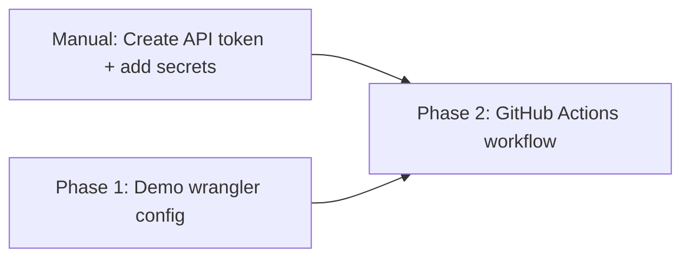

# Implementation Plan: Set up GitHub Action to auto-deploy demo

**Issue**: #6
**Created**: 2026-01-29
**Status**: In Progress

## Progress Tracking

| Phase   | Description                        | Status  | Started | Completed |
| ------- | ---------------------------------- | ------- | ------- | --------- |
| Phase 1 | Create demo wrangler config        | In Progress | 2026-01-29 | -         |
| Phase 2 | Create GitHub Actions workflow     | Pending | -       | -         |
| Manual  | Secrets, tokens, and repo cleanup  | Pending | -       | -         |

## Phase Dependencies



- Phase 1: No dependencies (start immediately)
- Phase 2: Depends on Phase 1 (needs the demo config file to reference)
- Manual steps: Must be done before Phase 2 can actually run in CI, but the code can be written first

Phase 1 and Phase 2 CAN be implemented in a single commit since Phase 2 just references the file from Phase 1, but they are logically distinct units.

## Summary

Add a GitHub Action workflow that automatically deploys the Holler demo to Cloudflare Workers on every push to `main`. This requires a separate wrangler config for the demo (with the real D1 database ID and a distinct worker name) and a workflow file that uses the official `cloudflare/wrangler-action@v3`.

## Requirements

- Deploy demo automatically on push to `main` (not on PRs)
- Use the existing demo worker name (`holler-demo`) and its D1 database
- Run D1 migrations before deploying
- Keep the main `wrangler.toml` unchanged (it uses `database_id = "local"` as a placeholder for one-click deploy)
- Secrets (`CLOUDFLARE_API_TOKEN`, `CLOUDFLARE_ACCOUNT_ID`, `DEMO_D1_DATABASE_ID`) stored in GitHub repo settings

## Technical Research Findings

- **`cloudflare/wrangler-action@v3`** is the official GitHub Action. It accepts `apiToken`, `accountId`, `command`, `environment`, `workingDirectory`, `preCommands`, and `postCommands` inputs.
- **`wrangler deploy --config <path>`** (`-c` flag) allows specifying a custom wrangler config file. This is cleaner than using `[env.*]` blocks for this use case, because the demo is a fundamentally different deployment target (different worker name, different database ID), not just an environment variant.
- **D1 migrations** must be applied before deploy. The existing `npm run deploy` script does: `wrangler d1 migrations apply DB --remote && wrangler deploy`. For the demo, we replicate this with the `--config` flag pointing to the demo config.
- **D1 database IDs are safe to commit** to config files (they are not secrets). However, per the issue, the database ID should be injected from a secret for flexibility. We will use `sed` to replace a placeholder in the demo config before deploy.
- The action does **not** have a built-in `--config` parameter, so we use the `command` input or `preCommands`/`postCommands` to pass the flag.

## Architecture Overview

- **New files**:
  - `.github/workflows/deploy-demo.yml` -- GitHub Actions workflow
  - `wrangler.demo.toml` -- Demo-specific wrangler configuration
- **Modified files**: None

---

## Phase 1: Create demo wrangler config

### Objective

Create a separate wrangler config file for the demo deployment that mirrors the main config but uses a distinct worker name and a placeholder for the D1 database ID (to be replaced at deploy time via CI).

### Steps

#### Step 1.1: Create `wrangler.demo.toml`

**Files**: `wrangler.demo.toml`

**Description**: Create a wrangler config for the demo worker. It is nearly identical to `wrangler.toml` but with:
- `name = "holler-demo"` (the demo worker name, matching the existing deployment)
- `database_id = "DEMO_D1_DATABASE_ID"` as a placeholder (replaced by CI before deploy)
- Same `compatibility_date`, `assets`, `main`, and `migrations_dir` settings

**Code approach**:

```toml
name = "holler-demo"
main = "src/index.tsx"
compatibility_date = "2025-01-01"

[assets]
directory = "./public"

[[d1_databases]]
binding = "DB"
database_name = "holler-demo-db"
database_id = "DEMO_D1_DATABASE_ID"
migrations_dir = "migrations"
```

**Pitfalls to avoid**:
- Do NOT hardcode the real database ID. Use a placeholder string that the CI pipeline will replace with the actual secret value.
- The `database_name` should match what the demo deployment uses. Use `"holler-demo-db"` as a reasonable name (the exact name is less critical than the `database_id` for remote operations).
- Keep `migrations_dir` pointing to the same `migrations/` directory -- both main and demo share the same schema.

### Verification

- [ ] File exists at `wrangler.demo.toml`
- [ ] Contains `name = "holler-demo"`
- [ ] Contains placeholder `database_id = "DEMO_D1_DATABASE_ID"`
- [ ] All other settings match `wrangler.toml` (except `name` and `database_id`)

---

## Phase 2: Create GitHub Actions workflow

### Objective

Create a GitHub Actions workflow that deploys the demo worker on every push to `main`, using the demo wrangler config with the real D1 database ID injected from secrets.

### Steps

#### Step 2.1: Create `.github/workflows/deploy-demo.yml`

**Files**: `.github/workflows/deploy-demo.yml`

**Description**: Create the workflow file. It triggers on pushes to `main` only. The job:
1. Checks out the repo
2. Sets up Node.js and installs dependencies
3. Replaces the `DEMO_D1_DATABASE_ID` placeholder in `wrangler.demo.toml` with the actual database ID from secrets
4. Runs D1 migrations using the demo config
5. Deploys the worker using the demo config

**Code approach**:

```yaml
name: Deploy Demo

on:
  push:
    branches:
      - main

jobs:
  deploy:
    runs-on: ubuntu-latest
    name: Deploy demo to Cloudflare Workers
    steps:
      - name: Checkout
        uses: actions/checkout@v4

      - name: Setup Node.js
        uses: actions/setup-node@v4
        with:
          node-version: "22"

      - name: Install dependencies
        run: npm ci

      - name: Inject demo database ID
        run: sed -i 's/DEMO_D1_DATABASE_ID/${{ secrets.DEMO_D1_DATABASE_ID }}/' wrangler.demo.toml

      - name: Apply D1 migrations
        uses: cloudflare/wrangler-action@v3
        with:
          apiToken: ${{ secrets.CLOUDFLARE_API_TOKEN }}
          accountId: ${{ secrets.CLOUDFLARE_ACCOUNT_ID }}
          command: d1 migrations apply DB --remote --config wrangler.demo.toml

      - name: Deploy
        uses: cloudflare/wrangler-action@v3
        with:
          apiToken: ${{ secrets.CLOUDFLARE_API_TOKEN }}
          accountId: ${{ secrets.CLOUDFLARE_ACCOUNT_ID }}
          command: deploy --config wrangler.demo.toml
```

**Pitfalls to avoid**:
- The `sed` command uses `-i` (in-place) which works on Linux (ubuntu-latest) but has different syntax on macOS. Since GitHub Actions runs on ubuntu-latest, this is fine.
- The `command` input to `wrangler-action` should NOT include the `wrangler` prefix -- the action prepends it automatically. So use `deploy --config wrangler.demo.toml`, not `wrangler deploy --config wrangler.demo.toml`.
- Use `npm ci` (not `npm install`) in CI for deterministic, faster installs.
- The `wrangler-action` installs its own wrangler, but since we already `npm ci` the project (which includes wrangler as a devDependency), the action will use the project-local version. This is the correct behavior.
- The workflow uses two separate `wrangler-action` steps (migrations + deploy) rather than a shell script, for cleaner CI output and error handling.
- Use `node-version: "22"` to match a current LTS release.

#### Step 2.2: Ensure `.github/workflows/` directory structure

**Files**: `.github/workflows/deploy-demo.yml`

**Description**: The `.github/` directory does not currently exist in the repo. The file creation will implicitly create the directory structure. No additional action needed.

### Verification

- [ ] File exists at `.github/workflows/deploy-demo.yml`
- [ ] Workflow triggers only on pushes to `main`
- [ ] Uses `cloudflare/wrangler-action@v3`
- [ ] References all three secrets: `CLOUDFLARE_API_TOKEN`, `CLOUDFLARE_ACCOUNT_ID`, `DEMO_D1_DATABASE_ID`
- [ ] Runs migrations before deploy
- [ ] Both wrangler commands use `--config wrangler.demo.toml`

---

## Manual Steps (not automated by code)

These steps must be performed by a human in the Cloudflare dashboard and GitHub settings:

### Manual Step 1: Create Cloudflare API Token

1. Go to Cloudflare Dashboard > Profile > API Tokens
2. Click "Create Token"
3. Use the "Edit Cloudflare Workers" template
4. Ensure the token has permissions for:
   - Workers Scripts: Edit
   - D1: Edit
   - Account: Read
5. Scope to the correct account
6. Save the token value

### Manual Step 2: Get the demo D1 database ID

1. Go to Cloudflare Dashboard > Workers & Pages > D1
2. Find the existing demo database (used by `holler-demo`)
3. Copy the Database ID (UUID format)

### Manual Step 3: Add secrets to GitHub repository

1. Go to GitHub repo Settings > Secrets and variables > Actions
2. Add three repository secrets:
   - `CLOUDFLARE_API_TOKEN` -- the API token from Manual Step 1
   - `CLOUDFLARE_ACCOUNT_ID` -- the Cloudflare account ID (visible in dashboard URL or overview page)
   - `DEMO_D1_DATABASE_ID` -- the D1 database ID from Manual Step 2

### Manual Step 4: Verify the action deploys successfully

1. Push the workflow file to `main` (or merge the PR)
2. Go to GitHub Actions tab and watch the "Deploy Demo" workflow run
3. Verify the demo is accessible at `https://holler-demo.holler-25b.workers.dev`
4. Verify D1 migrations applied correctly

### Manual Step 5: Archive the `holler-demo` repo

1. After confirming the action deploys successfully, archive or delete the separate `holler-demo` repository
2. This is now superseded by the GitHub Action in the main repo

---

## Testing Strategy

- **Build verification**: `npm run build` should still pass (no changes to source code)
- **Workflow syntax**: Validate YAML syntax before push (GitHub will also validate on push)
- **Manual testing**: After secrets are configured and the workflow runs, verify:
  1. The GitHub Action completes successfully (green check)
  2. D1 migrations applied without errors
  3. The demo at `https://holler-demo.holler-25b.workers.dev` reflects the latest code
  4. All features work: post creation, voting, search, admin

## Potential Risks

- **Secret misconfiguration**: If secrets are not set or are incorrect, the workflow will fail. Mitigation: the workflow will produce clear error messages from wrangler-action.
- **D1 database mismatch**: If the database ID is wrong, migrations will target the wrong database. Mitigation: verify the ID in the Cloudflare dashboard before adding the secret.
- **wrangler version incompatibility**: The `--config` flag for `d1 migrations apply` may not be available in all wrangler versions. Mitigation: the project pins `wrangler@^3` which supports this flag.
- **Demo-specific environment variables**: The demo may need Turnstile keys or admin token set as Worker secrets. These are not managed by this workflow (they are already set on the demo worker). The workflow only handles deployment, not secret management for the worker itself.

## Open Questions

- **Turnstile keys for demo**: Are Turnstile site key and secret already configured on the demo worker? If not, they would need to be set separately via `wrangler secret put` (one-time manual step, not part of the deploy workflow).
- **Demo database name**: What is the exact `database_name` used by the existing demo deployment? The plan uses `"holler-demo-db"` as a reasonable default, but this should be verified against the existing deployment.

---

## Completion Notes

[To be filled in as phases complete]
