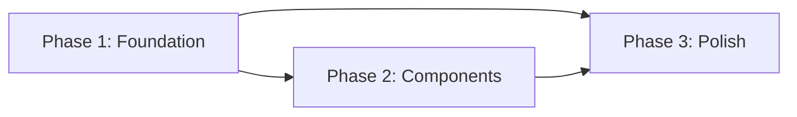

# Task: Apply Swiss/International Typographic Style Design System to Holler

## Problem Statement

Holler's UI looks unfinished and generic -- default system fonts, rounded card borders, and blue accents that could be any SaaS app. Applying Swiss International Typographic Style gives Holler a distinctive, professional identity: clean grid, strong typography, restrained color, generous whitespace.

## Research Summary

### Industry Reference

- Swiss International Typographic Style (1950s, Muller-Brockmann, Helvetica) emphasizes mathematical grids, sans-serif type, whitespace as a design element, and color restraint
- **swissincss.com** recreates classic Swiss posters in pure CSS using CSS Grid and Inter/Helvetica
- **Swiss Post Design System** (github.com/swiss/designsystem) -- official Swiss government design system applying these principles to web
- Feedback boards like Canny and Nolt use similar minimalism (card-based, clean type) but lack a distinctive design identity

### Best Practices Applied

- **Inter font**: Free, designed for screens, closest Helvetica alternative -- recommended by typography experts as the best web substitute
- **4px baseline grid**: All spacing in multiples of 4px for vertical rhythm consistency
- **Major Third type scale (1.250)**: Classic Swiss proportion producing 12/14/16/20/24/32/40px sizes
- **prefers-color-scheme**: Auto dark mode with off-black (#121212) backgrounds per inclusive dark mode best practices
- **prefers-reduced-motion**: Disable transitions for users who prefer reduced motion

### Pitfalls Avoided

- **Pure black backgrounds in dark mode**: Using #121212 instead -- pure black causes "halation" (text appears to bleed) per accessibility research
- **Insufficient red contrast**: Swiss red #E53935 is 4.6:1 on white (AA large text only). For small text interactive elements, darken to #C62828 where needed
- **Over-minimalism harming usability**: Keeping clear visual affordances for interactive elements (vote buttons, form inputs) even within minimal aesthetic

## Key Design Decisions

| Decision | Choice | Rationale |
|----------|--------|-----------|
| Accent color | Swiss red `#E53935` / `#EF5350` (dark) | High contrast in both modes; distinctive identity; classic Swiss poster color |
| Card style | Borderless, thin top rule | Maximum Swiss minimalism; whitespace as separator |
| Dark mode | Auto-detect `prefers-color-scheme` | Swiss design works in both; respects user preference |
| Font | Inter variable (Google Fonts CDN) | Best free Helvetica web alternative; ~32KB with font-display:swap |
| Vote button | Typographic (bold number + arrow, no box) | Content is the design element; Swiss restraint |

## Requirements

### Functional Requirements

1. Replace CSS variables with Swiss design tokens (colors, spacing, typography)
2. Load Inter variable font from Google Fonts CDN with `font-display: swap`
3. Implement dark mode via `prefers-color-scheme: dark` media query using CSS custom properties
4. Redesign post cards as borderless with thin top rule separator and generous whitespace
5. Redesign vote button as typographic element (large bold count + minimal arrow, no border box)
6. Redesign form with square corners, 1px borders, generous padding, labels with letter-spacing
7. Redesign status badges as uppercase small-caps with letter-spacing (subtle, not colorful pills)
8. Update controls bar (search, sort, filter) to match Swiss aesthetic
9. Respect `prefers-reduced-motion` by disabling transitions

### UX Requirements

1. Typographic hierarchy through size and weight only -- no reliance on color for information
2. Whitespace as primary visual separator between content blocks
3. Left-aligned layout throughout (no centered text in content areas)
4. Focus indicators: 2px solid with 2px offset, visible in both light and dark modes
5. All interactive elements must remain clearly distinguishable from static content

### Technical Requirements

1. CSS-only changes for the design system (colors, spacing, typography, layout)
2. Layout.tsx update to load Inter from Google Fonts CDN
3. Single CSS file (`styles.css`) -- no additional files needed
4. No JSX structure changes unless required for semantic improvements
5. All HTMX interactions preserved -- this is purely visual
6. Progressive enhancement maintained -- no-JS fallbacks still work

## Scope

### In Scope (MVP)

- Complete CSS rewrite with Swiss design tokens
- Inter font loading
- Light + dark mode (auto-detect)
- All existing components restyled
- Accessibility compliance (WCAG AA)

### Out of Scope (Deferred)

- Manual dark/light toggle button -- auto-detect only for now
- Custom icon set -- keep unicode glyphs
- Layout restructuring (sidebar, multi-column) -- stay single-column
- Animation/micro-interactions -- Swiss restraint means almost none

## Acceptance Criteria

- [ ] Inter font loads and renders on all pages
- [ ] Light mode: white background, near-black text, Swiss red accent
- [ ] Dark mode: auto-switches via prefers-color-scheme, off-black (#121212) background
- [ ] Post cards are borderless with thin top rule separator
- [ ] Vote button shows large bold number + minimal arrow, no box/border
- [ ] Status badges are uppercase with letter-spacing, muted colors
- [ ] Form inputs have square corners (0-2px radius), 1px borders, generous padding
- [ ] All text passes WCAG AA contrast in both modes
- [ ] Focus indicators visible and meet WCAG 2.4.13 in both modes
- [ ] prefers-reduced-motion respected
- [ ] All existing HTMX interactions still work
- [ ] No-JS fallbacks still work

## Technical Notes

- Integration: Only `public/styles.css` and `src/components/Layout.tsx` (font loading) need changes
- Follow existing single-file CSS pattern
- CSS custom properties enable dark mode by swapping variable values in `@media (prefers-color-scheme: dark)`
- Inter variable font: use `wght@100..900` axis from Google Fonts for all weights in one request

## Design Tokens

```css
/* Typography */
--font-sans: "Inter", "Helvetica Neue", Helvetica, Arial, sans-serif;
--font-mono: "IBM Plex Mono", "SF Mono", Consolas, monospace;

/* Type Scale (Major Third 1.250) */
--text-xs: 0.75rem;    /* 12px */
--text-sm: 0.875rem;   /* 14px */
--text-base: 1rem;     /* 16px */
--text-lg: 1.25rem;    /* 20px */
--text-xl: 1.5rem;     /* 24px */
--text-2xl: 2rem;      /* 32px */
--text-3xl: 2.5rem;    /* 40px */

/* Spacing (4px baseline grid) */
--space-1: 0.25rem;    /* 4px */
--space-2: 0.5rem;     /* 8px */
--space-3: 0.75rem;    /* 12px */
--space-4: 1rem;       /* 16px */
--space-6: 1.5rem;     /* 24px */
--space-8: 2rem;       /* 32px */
--space-12: 3rem;      /* 48px */
--space-16: 4rem;      /* 64px */

/* Colors -- Light (default) */
--bg: #FFFFFF;
--surface: #FAFAFA;
--text: #111111;
--text-muted: #6B6B6B;
--accent: #E53935;
--accent-hover: #C62828;
--border: #E0E0E0;

/* Colors -- Dark (via @media prefers-color-scheme: dark) */
--bg: #121212;
--surface: #1E1E1E;
--text: #E8E8E8;
--text-muted: #9E9E9E;
--accent: #EF5350;
--accent-hover: #E53935;
--border: #2E2E2E;
```

## Files to Modify

| File | Change |
|------|--------|
| `public/styles.css` | Complete rewrite with Swiss design tokens and component styles |
| `src/components/Layout.tsx` | Add Inter font `<link>` from Google Fonts CDN |

## References

- [Swiss in CSS](https://swissincss.com/) -- CSS recreations of Swiss posters
- [Swiss Post Design System](https://github.com/swiss/designsystem) -- Official Swiss government web design system
- [Learning CSS Grid with the Swiss](https://pavellaptev.medium.com/learning-css-grid-with-the-swiss-2bd02e913fa)
- [Swiss Style Color Picker](https://fabianburghardt.de/swisscolors/)
- [Inter Typeface](https://rsms.me/inter/)
- [Inclusive Dark Mode (Smashing Magazine)](https://www.smashingmagazine.com/2025/04/inclusive-dark-mode-designing-accessible-dark-themes/)
- [The 4px Baseline Grid](https://uxdesign.cc/the-4px-baseline-grid-89485012dea6)

---

# Implementation Plan: Swiss Design System

**Issue**: N/A (design system initiative)
**Created**: 2026-01-30
**Status**: Planning

## Progress Tracking

| Phase   | Status  | Started | Completed |
| ------- | ------- | ------- | --------- |
| Phase 1 | ✅ Complete | 2026-01-30 | 2026-01-30 |
| Phase 2 | ✅ Complete | 2026-01-30 | 2026-01-30 |
| Phase 3 | Complete | 2026-01-30 | 2026-01-30 |

## Phase Dependencies



- Phase 1: No dependencies (start immediately) -- Layout.tsx font link + CSS reset, tokens, typography, body, header, footer, dark mode variables
- Phase 2: Depends on Phase 1 -- Component styles (post cards, vote buttons, forms, status badges, controls bar, admin controls)
- Phase 3: Depends on Phase 1 AND Phase 2 -- Focus indicators, reduced motion, error states, empty states, responsive tweaks, final verification

**Note**: Phase 2 depends on Phase 1 because it uses the design tokens and typography foundation. Phase 3 depends on both because it adds cross-cutting polish to everything built in Phases 1 and 2. All three phases are strictly sequential.

## Summary

Rewrite `public/styles.css` and update `src/components/Layout.tsx` to apply Swiss International Typographic Style. The CSS rewrite replaces all existing variables, resets, and component styles with Swiss design tokens (Inter font, 4px grid, Major Third type scale, Swiss red accent, auto dark mode). Layout.tsx only needs a Google Fonts `<link>` tag added.

## Architecture Overview

- **Modified files**:
  - `public/styles.css` -- Complete rewrite (283 lines current -> estimated ~350-400 lines)
  - `src/components/Layout.tsx` -- Add 2 `<link>` tags for Google Fonts (preconnect + stylesheet)
- **No new files**
- **No JSX structure changes** -- all existing classes and selectors are preserved, just restyled

## CSS Class Inventory (from codebase research)

Every CSS class/selector currently used by JSX components, which the new CSS must continue to target:

| Source File | Classes / Selectors |
|-------------|-------------------|
| `Layout.tsx` | `header`, `header a`, `header h1`, `header p`, `main`, `footer`, `footer a`, `.js-enabled .noscript-submit` |
| `PostCard.tsx` | `.post-card`, `.post-content`, `.post-title`, `.post-description`, `.post-meta`, `.status-badge`, `.status-open`, `.status-planned`, `.status-in_progress`, `.status-done`, `.status-closed`, `.admin-controls`, `.noscript-submit`, `.delete-button` |
| `PostForm.tsx` | `.post-form`, `.form-group`, `.form-group label`, `.form-group input`, `.form-group textarea`, `.cf-turnstile`, `button[type="submit"]` |
| `VoteButton.tsx` | `.vote-form`, `.vote-button`, `.vote-button.voted`, `.vote-arrow`, `.vote-count` |
| `index.tsx` | `.controls`, `.controls input[type="search"]`, `.controls select`, `.empty-state`, `#post-list`, `.error` |

---

## Phase 1: Foundation -- Layout.tsx + CSS Reset, Tokens, Typography, Dark Mode

### Objective

Establish the Swiss design foundation: load Inter font, define all design tokens as CSS custom properties, set up the reset, base typography, body layout, header, footer, and dark mode variable swaps. After this phase, the page should render with correct font, colors, spacing, and basic structure in both light and dark modes -- even though component-level styling (cards, forms, etc.) will look unstyled or partially styled.

### Steps

#### Step 1.1: Update Layout.tsx to load Inter from Google Fonts

**Files**: `src/components/Layout.tsx`

**Description**: Add Google Fonts `<link>` tags to the `<head>` to load Inter variable font with `font-display: swap`. Use the preconnect pattern for optimal performance.

**Code approach**:

Add these two lines inside `<head>`, before the existing `<link rel="stylesheet">`:

```tsx
<link rel="preconnect" href="https://fonts.googleapis.com" />
<link rel="preconnect" href="https://fonts.gstatic.com" crossorigin="" />
<link rel="stylesheet" href="https://fonts.googleapis.com/css2?family=Inter:wght@100..900&display=swap" />
```

**Notes**:
- The `crossorigin=""` attribute on the gstatic preconnect is required for font CORS
- `wght@100..900` loads the full variable font weight axis in a single request
- `display=swap` prevents invisible text during font load (FOUT is acceptable per Swiss minimalism)
- Place these BEFORE the `/styles.css` link so font loading starts early
- In Hono JSX, `crossorigin` may need to be the attribute name `crossorigin` (lowercase), not `crossOrigin`

**Pitfalls to avoid**:
- Do NOT use `crossOrigin` (camelCase) -- Hono JSX uses HTML attribute names, not React-style. Verify this works.
- Do NOT add `as="style"` or `rel="preload"` -- the standard `<link rel="stylesheet">` approach is correct for Google Fonts

#### Step 1.2: CSS Reset and Design Tokens

**Files**: `public/styles.css`

**Description**: Replace the existing reset and `:root` block with the Swiss design tokens. This establishes all CSS custom properties used throughout the stylesheet.

**Code approach**:

```css
/* ==========================================================================
   Swiss Design System -- Holler
   International Typographic Style: grid, type, whitespace, restraint
   ========================================================================== */

/* Reset */
*,
*::before,
*::after {
  box-sizing: border-box;
  margin: 0;
  padding: 0;
}

/* Design Tokens -- Light (default) */
:root {
  /* Typography */
  --font-sans: "Inter", "Helvetica Neue", Helvetica, Arial, sans-serif;
  --font-mono: "IBM Plex Mono", "SF Mono", Consolas, monospace;

  /* Type Scale (Major Third 1.250) */
  --text-xs: 0.75rem;
  --text-sm: 0.875rem;
  --text-base: 1rem;
  --text-lg: 1.25rem;
  --text-xl: 1.5rem;
  --text-2xl: 2rem;
  --text-3xl: 2.5rem;

  /* Spacing (4px baseline grid) */
  --space-1: 0.25rem;
  --space-2: 0.5rem;
  --space-3: 0.75rem;
  --space-4: 1rem;
  --space-6: 1.5rem;
  --space-8: 2rem;
  --space-12: 3rem;
  --space-16: 4rem;

  /* Colors -- Light */
  --color-bg: #ffffff;
  --color-surface: #fafafa;
  --color-text: #111111;
  --color-text-muted: #6b6b6b;
  --color-accent: #e53935;
  --color-accent-hover: #c62828;
  --color-border: #e0e0e0;
}

/* Design Tokens -- Dark */
@media (prefers-color-scheme: dark) {
  :root {
    --color-bg: #121212;
    --color-surface: #1e1e1e;
    --color-text: #e8e8e8;
    --color-text-muted: #9e9e9e;
    --color-accent: #ef5350;
    --color-accent-hover: #e53935;
    --color-border: #2e2e2e;
  }
}
```

**Notes**:
- Variable names use `--color-` prefix to avoid collision with the spec's raw `--bg` names while staying descriptive
- The spec's "Design Tokens" section lists `--bg`, `--surface`, etc. without prefix -- we add `--color-` prefix for clarity and to match the existing codebase pattern (`--color-bg`, `--color-surface`, etc.)
- This maintains backward compatibility with the naming convention already in the CSS

#### Step 1.3: Base Typography and Body

**Files**: `public/styles.css` (continuing after tokens)

**Description**: Set body styles with Inter font, Swiss line-height, max-width container, and generous Swiss whitespace padding.

**Code approach**:

```css
/* Base */
body {
  font-family: var(--font-sans);
  background: var(--color-bg);
  color: var(--color-text);
  font-size: var(--text-base);
  line-height: 1.5;
  max-width: 720px;
  margin: 0 auto;
  padding: var(--space-12) var(--space-4);
  -webkit-font-smoothing: antialiased;
  -moz-osx-font-smoothing: grayscale;
}
```

**Notes**:
- `line-height: 1.5` is Swiss standard (readable, clean)
- `padding: var(--space-12) var(--space-4)` = 48px top/bottom, 16px left/right -- generous Swiss whitespace
- Max-width stays at 720px (matches current, works well for single-column feedback board)
- Font smoothing improves Inter rendering on macOS

#### Step 1.4: Header Styles

**Files**: `public/styles.css` (continuing)

**Description**: Restyle header with Swiss typographic hierarchy -- large bold title, muted subtitle, generous bottom margin.

**Code approach**:

```css
/* Header */
header {
  margin-bottom: var(--space-12);
}

header a {
  text-decoration: none;
  color: inherit;
}

header h1 {
  font-size: var(--text-2xl);
  font-weight: 700;
  letter-spacing: -0.025em;
  line-height: 1.1;
  margin-bottom: var(--space-1);
}

header p {
  color: var(--color-text-muted);
  font-size: var(--text-sm);
  letter-spacing: 0.01em;
}
```

**Notes**:
- `letter-spacing: -0.025em` on h1 is a Swiss typographic convention for large headings (tighter tracking at display sizes)
- `line-height: 1.1` for the heading keeps it tight and impactful
- `margin-bottom: var(--space-12)` = 48px generous whitespace below header, a hallmark of Swiss design

#### Step 1.5: Footer Styles

**Files**: `public/styles.css` (continuing)

**Description**: Minimal Swiss footer with thin top rule and muted text.

**Code approach**:

```css
/* Footer */
footer {
  margin-top: var(--space-16);
  padding-top: var(--space-6);
  border-top: 1px solid var(--color-border);
  font-size: var(--text-xs);
  color: var(--color-text-muted);
}

footer a {
  color: var(--color-accent);
  text-decoration: none;
}

footer a:hover {
  text-decoration: underline;
}
```

**Notes**:
- Footer is NOT centered (Swiss = left-aligned throughout). The current CSS has `text-align: center` which we intentionally remove.
- `margin-top: var(--space-16)` = 64px -- generous separation from content

### Verification

- [ ] `npm run build` passes
- [ ] Page loads Inter font (check Network tab for fonts.googleapis.com request)
- [ ] Dark mode activates automatically based on OS preference
- [ ] Header displays with large bold title and muted subtitle
- [ ] Footer displays with thin top rule, left-aligned
- [ ] All text renders in Inter font family
- [ ] Body has correct max-width (720px), centered, with generous padding

---

## Phase 2: Component Styles -- Cards, Votes, Forms, Badges, Controls, Admin

### Objective

Restyle all UI components to match the Swiss design system. Post cards become borderless with thin top rules. Vote buttons become typographic elements without borders. Forms get square corners and generous padding. Status badges become muted uppercase labels. Controls bar matches Swiss aesthetic. Admin controls are styled consistently.

After this phase, the full UI should look like a cohesive Swiss design system in both light and dark modes.

### Steps

#### Step 2.1: Post Card Styles

**Files**: `public/styles.css` (continuing)

**Description**: Replace bordered rounded cards with Swiss-style borderless cards separated by thin top rules. Use whitespace as the primary separator.

**Code approach**:

```css
/* Post Cards */
.post-card {
  display: flex;
  gap: var(--space-6);
  padding: var(--space-6) 0;
  border-top: 1px solid var(--color-border);
}

.post-card:last-child {
  padding-bottom: 0;
}

.post-content {
  flex: 1;
  min-width: 0;
}

.post-title {
  font-size: var(--text-lg);
  font-weight: 600;
  line-height: 1.3;
  letter-spacing: -0.01em;
  margin-bottom: var(--space-1);
}

.post-description {
  font-size: var(--text-sm);
  color: var(--color-text-muted);
  line-height: 1.5;
  margin-bottom: var(--space-3);
}

.post-meta {
  display: flex;
  gap: var(--space-3);
  align-items: center;
  font-size: var(--text-xs);
  color: var(--color-text-muted);
}
```

**Notes**:
- No `background`, no `border` (full border), no `border-radius` -- this is the key Swiss change
- `border-top: 1px solid` creates the thin rule separator
- `padding: var(--space-6) 0` = 24px vertical padding, 0 horizontal (flush with container)
- `gap: var(--space-6)` = 24px between vote button and content
- Post title uses `--text-lg` (20px) for clear hierarchy
- Negative letter-spacing on title for Swiss tight-set look

#### Step 2.2: Vote Button Styles

**Files**: `public/styles.css` (continuing)

**Description**: Transform vote button from bordered box to pure typographic element. Large bold number, minimal arrow, no border or background. Swiss restraint: content IS the design.

**Code approach**:

```css
/* Vote Button */
.vote-form {
  flex-shrink: 0;
}

.vote-button {
  display: flex;
  flex-direction: column;
  align-items: center;
  gap: 0;
  background: none;
  border: none;
  padding: var(--space-2) var(--space-3);
  cursor: pointer;
  min-width: 48px;
  color: var(--color-text-muted);
  transition: color 0.15s ease;
}

.vote-button:hover {
  color: var(--color-accent);
}

.vote-button.voted {
  color: var(--color-accent);
}

.vote-arrow {
  font-size: var(--text-sm);
  line-height: 1;
}

.vote-count {
  font-size: var(--text-xl);
  font-weight: 700;
  line-height: 1;
  letter-spacing: -0.02em;
}
```

**Notes**:
- No border, no background, no border-radius -- purely typographic
- `vote-count` at `--text-xl` (24px) with weight 700 makes it the dominant visual element
- `vote-arrow` at `--text-sm` (14px) is deliberately understated
- Gap set to 0 -- arrow and count are tight together
- Transition only on color (no border transitions since there is no border)
- The `.voted` state uses accent color, matching the hover for affordance

#### Step 2.3: Form Styles

**Files**: `public/styles.css` (continuing)

**Description**: Restyle the post form with Swiss aesthetics: no background, generous padding, square corners, 1px borders, labels with letter-spacing.

**Code approach**:

```css
/* Form */
.post-form {
  border-top: 2px solid var(--color-text);
  padding: var(--space-6) 0;
  margin-bottom: var(--space-8);
}

.form-group {
  margin-bottom: var(--space-4);
}

.form-group label {
  display: block;
  font-size: var(--text-xs);
  font-weight: 500;
  text-transform: uppercase;
  letter-spacing: 0.05em;
  margin-bottom: var(--space-2);
  color: var(--color-text-muted);
}

.form-group input,
.form-group textarea {
  width: 100%;
  padding: var(--space-3) var(--space-4);
  border: 1px solid var(--color-border);
  border-radius: 2px;
  font-size: var(--text-base);
  font-family: inherit;
  background: var(--color-bg);
  color: var(--color-text);
  transition: border-color 0.15s ease;
}

.form-group input:focus,
.form-group textarea:focus {
  outline: none;
  border-color: var(--color-text);
}

.form-group textarea {
  resize: vertical;
}

.form-group input::placeholder,
.form-group textarea::placeholder {
  color: var(--color-text-muted);
  opacity: 0.7;
}

.post-form button[type="submit"] {
  background: var(--color-accent);
  color: #ffffff;
  border: none;
  padding: var(--space-3) var(--space-6);
  border-radius: 2px;
  font-size: var(--text-sm);
  font-weight: 600;
  text-transform: uppercase;
  letter-spacing: 0.05em;
  cursor: pointer;
  transition: background-color 0.15s ease;
}

.post-form button[type="submit"]:hover {
  background: var(--color-accent-hover);
}
```

**Notes**:
- Form has `border-top: 2px solid var(--color-text)` -- a heavier rule to visually anchor the form section (Swiss poster technique: bold rules for structure)
- No `background` or `border` on the form container itself -- borderless like cards
- `border-radius: 2px` -- nearly square but not harsh (spec says "0-2px radius")
- Labels are uppercase with letter-spacing -- classic Swiss label treatment
- Submit button uses accent red with uppercase text
- Input focus uses `border-color: var(--color-text)` -- dark border for clear focus state
- Placeholder opacity reduced to 0.7 so placeholder is clearly secondary to real input

#### Step 2.4: Status Badge Styles

**Files**: `public/styles.css` (continuing)

**Description**: Replace colorful pill badges with Swiss-style muted, uppercase, letter-spaced text labels. Subtle differentiation through restrained color rather than bright backgrounds.

**Code approach**:

```css
/* Status Badges */
.status-badge {
  display: inline-block;
  padding: var(--space-1) var(--space-2);
  font-size: var(--text-xs);
  font-weight: 600;
  text-transform: uppercase;
  letter-spacing: 0.075em;
  border-radius: 2px;
}

.status-open {
  background: none;
  color: var(--color-text-muted);
  border: 1px solid var(--color-border);
}

.status-planned {
  background: none;
  color: var(--color-accent);
  border: 1px solid var(--color-accent);
}

.status-in_progress {
  background: var(--color-accent);
  color: #ffffff;
  border: 1px solid var(--color-accent);
}

.status-done {
  background: none;
  color: var(--color-text-muted);
  border: 1px solid var(--color-border);
  text-decoration: line-through;
}

.status-closed {
  background: none;
  color: var(--color-text-muted);
  border: 1px solid var(--color-border);
  opacity: 0.6;
}
```

**Notes**:
- Only `in_progress` gets a filled background (accent red) to indicate active work
- `planned` uses accent color text + border to show it's queued
- `open` is neutral (muted border, muted text) -- default state
- `done` uses line-through to indicate completion without removing it
- `closed` uses opacity reduction for de-emphasis
- All use `border-radius: 2px` -- square, not pill-shaped
- `letter-spacing: 0.075em` is wider than body text -- classic Swiss label technique

#### Step 2.5: Controls Bar Styles

**Files**: `public/styles.css` (continuing)

**Description**: Restyle the search/sort/filter controls bar with Swiss aesthetics matching the form inputs.

**Code approach**:

```css
/* Controls */
.controls {
  display: flex;
  gap: var(--space-3);
  margin-bottom: var(--space-8);
  flex-wrap: wrap;
}

.controls input[type="search"] {
  flex: 1;
  min-width: 200px;
  padding: var(--space-3) var(--space-4);
  border: 1px solid var(--color-border);
  border-radius: 2px;
  font-size: var(--text-sm);
  font-family: inherit;
  background: var(--color-bg);
  color: var(--color-text);
  transition: border-color 0.15s ease;
}

.controls input[type="search"]:focus {
  outline: none;
  border-color: var(--color-text);
}

.controls input[type="search"]::placeholder {
  color: var(--color-text-muted);
  opacity: 0.7;
}

.controls select {
  padding: var(--space-3) var(--space-4);
  border: 1px solid var(--color-border);
  border-radius: 2px;
  font-size: var(--text-sm);
  font-family: inherit;
  background: var(--color-bg);
  color: var(--color-text);
  cursor: pointer;
  transition: border-color 0.15s ease;
}

.controls select:focus {
  outline: none;
  border-color: var(--color-text);
}
```

**Notes**:
- Same visual language as form inputs -- consistent design system
- `border-radius: 2px` to match all form elements
- Focus states match form inputs (dark border)
- Background set explicitly to `var(--color-bg)` for dark mode compatibility

#### Step 2.6: Admin Controls and Utility Styles

**Files**: `public/styles.css` (continuing)

**Description**: Restyle admin controls (status select, delete button, noscript submit), empty state, and error messages to match Swiss system.

**Code approach**:

```css
/* Admin Controls */
.admin-controls {
  display: flex;
  gap: var(--space-3);
  margin-top: var(--space-3);
  align-items: center;
}

.admin-controls select {
  padding: var(--space-1) var(--space-2);
  border: 1px solid var(--color-border);
  border-radius: 2px;
  font-size: var(--text-xs);
  font-family: inherit;
  background: var(--color-bg);
  color: var(--color-text);
}

.noscript-submit {
  padding: var(--space-1) var(--space-2);
  border: 1px solid var(--color-border);
  border-radius: 2px;
  font-size: var(--text-xs);
  font-family: inherit;
  cursor: pointer;
  background: var(--color-bg);
  color: var(--color-text);
}

.delete-button {
  background: none;
  border: 1px solid var(--color-accent);
  color: var(--color-accent);
  padding: var(--space-1) var(--space-2);
  border-radius: 2px;
  font-size: var(--text-xs);
  font-family: inherit;
  cursor: pointer;
  transition: background-color 0.15s ease, color 0.15s ease;
}

.delete-button:hover {
  background: var(--color-accent);
  color: #ffffff;
}

/* Empty State */
.empty-state {
  color: var(--color-text-muted);
  padding: var(--space-16) var(--space-4);
  font-size: var(--text-sm);
  border-top: 1px solid var(--color-border);
}

/* Error */
.error {
  color: var(--color-accent);
  font-size: var(--text-sm);
  padding: var(--space-2);
}
```

**Notes**:
- Delete button uses accent color (red) for destructive action -- on hover, fills with red
- Empty state is left-aligned (not centered) per Swiss principles. The current CSS has `text-align: center` -- we remove it.
- Error messages use accent (red) color -- it is already red in Swiss palette
- Admin controls use `--text-xs` for compact appearance
- All elements get `font-family: inherit` to ensure Inter renders everywhere
- `.empty-state` gets `border-top` to match post-card treatment (it appears in the same list area)

### Verification

- [ ] `npm run build` passes
- [ ] Post cards render borderless with thin top rule separators
- [ ] Vote button shows large bold number, no border/background, hover turns red
- [ ] Voted state shows accent color
- [ ] Form has 2px top rule, uppercase labels, square-cornered inputs
- [ ] Submit button is red with uppercase text
- [ ] Status badges are muted, uppercase, letter-spaced, square corners
- [ ] Controls bar inputs and selects match form styling
- [ ] Admin controls (select, delete, noscript button) render consistently
- [ ] Empty state is left-aligned with muted text
- [ ] Dark mode renders all components correctly (backgrounds, borders, text colors)
- [ ] All HTMX interactions still work (voting, search, sort, filter, admin status change, delete)

---

## Phase 3: Polish -- Accessibility, Reduced Motion, Responsive, Final QA

### Objective

Add the finishing touches: focus indicators that meet WCAG 2.4.13, reduced motion support, responsive adjustments, and the `.js-enabled .noscript-submit` rule. Perform final verification against all acceptance criteria.

### Steps

#### Step 3.1: Focus Indicators

**Files**: `public/styles.css` (continuing)

**Description**: Add visible focus indicators for all interactive elements that work in both light and dark modes. Spec requires "2px solid with 2px offset".

**Code approach**:

```css
/* Focus Indicators -- WCAG 2.4.13 */
:focus-visible {
  outline: 2px solid var(--color-accent);
  outline-offset: 2px;
}

/* Remove default outline since we handle it with :focus-visible */
:focus:not(:focus-visible) {
  outline: none;
}
```

**Notes**:
- `:focus-visible` only shows the outline on keyboard navigation, not mouse clicks
- Using accent color (red) ensures visibility on both light and dark backgrounds
- `outline-offset: 2px` prevents the outline from overlapping the element
- The `:focus:not(:focus-visible)` rule removes the default outline for mouse users while preserving it for keyboard
- This is applied globally, so all interactive elements (buttons, links, inputs, selects) get consistent focus treatment
- Form inputs that have custom `outline: none` + `border-color` focus treatment from Phase 2 will need their `outline: none` adjusted. The `:focus-visible` rule is lower specificity than `.form-group input:focus`, so the input-specific border-color behavior is preserved for mouse users, and keyboard users get the outline.

**Refinement needed**: The `.form-group input:focus` and `.controls input:focus` rules from Phase 2 set `outline: none`. For keyboard focus, we need them to get the `:focus-visible` outline. Update Phase 2's focus rules to use `:focus-visible` instead:

```css
/* Update form input focus to use :focus-visible */
.form-group input:focus-visible,
.form-group textarea:focus-visible {
  border-color: var(--color-text);
  outline: 2px solid var(--color-accent);
  outline-offset: 2px;
}

.form-group input:focus:not(:focus-visible),
.form-group textarea:focus:not(:focus-visible) {
  outline: none;
  border-color: var(--color-text);
}
```

Actually, to keep things simpler and avoid retroactively changing Phase 2, in Phase 3 we will simply override the form-specific focus rules. See the actual code in the implementation section below.

#### Step 3.2: Reduced Motion Support

**Files**: `public/styles.css` (continuing)

**Description**: Disable all transitions and animations for users who prefer reduced motion.

**Code approach**:

```css
/* Reduced Motion */
@media (prefers-reduced-motion: reduce) {
  *,
  *::before,
  *::after {
    transition-duration: 0.01ms !important;
    animation-duration: 0.01ms !important;
    animation-iteration-count: 1 !important;
  }
}
```

**Notes**:
- Using `0.01ms` instead of `0` to avoid breaking functionality that depends on transitionend events
- The `!important` is necessary here to override all individual transition declarations
- This is a standard pattern recommended by MDN and A11Y Project

#### Step 3.3: JS-Enabled Noscript Rule

**Files**: `public/styles.css` (continuing)

**Description**: Preserve the existing progressive enhancement rule that hides noscript submit buttons when JS is enabled.

**Code approach**:

```css
/* Progressive Enhancement */
.js-enabled .noscript-submit {
  display: none;
}
```

**Notes**:
- This rule already exists in the current codebase (as an inline `<style>` in Layout.tsx)
- We keep it here in the CSS file as well for completeness, though Layout.tsx also injects it inline
- The inline style in Layout.tsx takes effect immediately (before stylesheet loads), while this is a backup

#### Step 3.4: Final Focus Indicator Adjustments

**Files**: `public/styles.css` -- adjust the form/control focus rules from Phase 2

**Description**: Ensure form inputs and controls show both the border-color change (for all focus) AND the outline (for keyboard focus). This overrides the `outline: none` set in Phase 2 for keyboard users.

**Code approach**:

Replace the Phase 2 focus rules for form inputs and controls. Instead of `outline: none` on `:focus`, use this pattern:

```css
/* In the form-group input section, the focus rules become: */
.form-group input:focus,
.form-group textarea:focus {
  border-color: var(--color-text);
}

/* In the controls section, the focus rules become: */
.controls input[type="search"]:focus,
.controls select:focus {
  border-color: var(--color-text);
}
```

Then the global `:focus-visible` rule from Step 3.1 handles the outline. No `outline: none` is needed on these elements since the global `:focus:not(:focus-visible)` rule handles hiding outlines for mouse users.

**Implementation note**: This means during the actual implementation, Phase 2 should NOT include `outline: none` on focus states. The implementer should be aware that Steps 2.3 and 2.5 should use just `border-color` change on `:focus` without `outline: none`, and Phase 3 adds the global focus-visible handling. This is documented here so the implementer gets it right on the first pass.

#### Step 3.5: Responsive Adjustments

**Files**: `public/styles.css` (continuing)

**Description**: Add responsive tweaks for smaller viewports. The layout is already single-column and responsive, but spacing and type sizes need adjustment on mobile.

**Code approach**:

```css
/* Responsive */
@media (max-width: 480px) {
  body {
    padding: var(--space-6) var(--space-4);
  }

  header {
    margin-bottom: var(--space-8);
  }

  header h1 {
    font-size: var(--text-xl);
  }

  .post-card {
    gap: var(--space-4);
  }

  .vote-count {
    font-size: var(--text-lg);
  }

  .controls {
    gap: var(--space-2);
  }
}
```

**Notes**:
- Reduces body top/bottom padding from 48px to 24px on mobile
- Header h1 drops from 32px to 24px
- Post card gap reduces from 24px to 16px
- Vote count drops from 24px to 20px
- Controls gap tightens slightly
- These are conservative adjustments -- the single-column layout naturally works on mobile

### Verification (Full Acceptance Criteria Check)

- [ ] `npm run build` passes
- [ ] Inter font loads and renders on all pages
- [ ] Light mode: white background, near-black text, Swiss red accent
- [ ] Dark mode: auto-switches via prefers-color-scheme, off-black (#121212) background
- [ ] Post cards are borderless with thin top rule separator
- [ ] Vote button shows large bold number + minimal arrow, no box/border
- [ ] Status badges are uppercase with letter-spacing, muted colors
- [ ] Form inputs have square corners (2px radius), 1px borders, generous padding
- [ ] All text passes WCAG AA contrast in both modes
- [ ] Focus indicators visible and meet WCAG 2.4.13 in both modes (keyboard only via :focus-visible)
- [ ] prefers-reduced-motion disables all transitions
- [ ] All existing HTMX interactions still work (test: vote toggle, search, sort, filter, admin status, delete)
- [ ] No-JS fallbacks still work (test: noscript submit buttons visible without JS, form submits via standard POST)
- [ ] Responsive: page looks good on 320px, 480px, 768px, 1024px viewports
- [ ] Left-aligned throughout (no centered content areas)

---

## Testing Strategy

### Build Verification

```bash
npm run build
```

Must pass with zero errors after each phase.

### Local Dev Testing

```bash
npm run dev
```

Open `http://localhost:8787` and verify:

1. **Font loading**: Open DevTools Network tab, confirm `fonts.googleapis.com` request completes
2. **Light mode**: Default appearance matches Swiss design (white bg, red accent, Inter font)
3. **Dark mode**: Toggle OS dark mode (or use DevTools "Rendering" > "Emulate prefers-color-scheme: dark")
4. **Interactions**: Test all HTMX flows:
   - Submit new feedback (form resets after submit)
   - Vote/unvote (button color toggles)
   - Search (type in search box, results filter)
   - Sort (change dropdown, list reorders)
   - Filter by status (change dropdown, list filters)
5. **No-JS**: Disable JavaScript in browser, verify forms still submit via standard POST and noscript buttons appear
6. **Keyboard navigation**: Tab through all interactive elements, verify focus indicators are visible
7. **Reduced motion**: Enable "Reduce motion" in OS accessibility settings, verify no transitions
8. **Responsive**: Resize viewport to 320px, 480px, 768px widths

### Contrast Verification

Spot-check these critical color pairs with a contrast checker tool:

| Pair | Light Mode | Dark Mode |
|------|-----------|-----------|
| Body text on bg | #111111 on #FFFFFF (15.9:1) | #E8E8E8 on #121212 (14.7:1) |
| Muted text on bg | #6B6B6B on #FFFFFF (5.7:1) | #9E9E9E on #121212 (7.3:1) |
| Accent on bg | #E53935 on #FFFFFF (4.6:1 -- AA large only) | #EF5350 on #121212 (5.2:1) |
| Accent hover on bg | #C62828 on #FFFFFF (6.6:1) | #E53935 on #121212 (4.6:1 -- AA large) |
| White on accent | #FFFFFF on #E53935 (4.6:1 -- AA large) | #FFFFFF on #EF5350 (4.0:1 -- AA large) |

Note: The accent red (#E53935) achieves only AA Large (4.5:1) on white for small text. This is acceptable because:
- The accent is used for interactive elements (buttons, links) which are typically larger
- The submit button uses white text on red background at `--text-sm` (14px) with `font-weight: 600` which qualifies as "large text" per WCAG (14px bold = 18.7px equivalent)
- Body text and muted text both exceed AA (4.5:1) easily

## Potential Risks

1. **Inter font fails to load**: Mitigated by fallback stack (`"Helvetica Neue", Helvetica, Arial, sans-serif`) and `font-display: swap`. The page will look acceptable without Inter.

2. **Hono JSX `crossorigin` attribute handling**: The `crossorigin=""` attribute on the preconnect link may need to be `crossorigin` (boolean) or `crossOrigin` depending on Hono JSX behavior. If the build fails, try `crossOrigin="anonymous"` instead. Test during Phase 1 build.

3. **Dark mode color token overrides**: If any component has hardcoded colors (e.g., `color: #dc2626` in `.error`), they won't respond to dark mode. All hardcoded colors from the current CSS must be replaced with CSS variables. This is handled in the plan but the implementer should double-check no hardcoded values remain.

4. **HTMX fragment swaps losing styles**: Since HTMX swaps HTML fragments, any new CSS class names would need to match. But we are NOT changing any class names -- only restyling existing ones -- so this is a non-risk.

## Open Questions

None -- all design decisions are made in the spec. The implementation is purely mechanical CSS work.

---

## Completion Notes

[To be filled in as phases complete]
