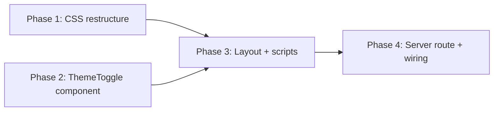

# Implementation Plan: Theme Toggle (Light/Dark)

**Issue**: N/A (feature request)
**Created**: 2026-01-30
**Status**: In Progress

## Progress Tracking

| Phase   | Status      | Started    | Completed  |
| ------- | ----------- | ---------- | ---------- |
| Phase 1 | Complete | 2026-01-30 | 2026-01-30 |
| Phase 2 | Complete | 2026-01-30 | 2026-01-30 |
| Phase 3 | Complete | 2026-01-30 | 2026-01-30 |
| Phase 4 | Complete | 2026-01-30 | 2026-01-30 |

### Phase 1 Completion Notes
- Modified: `public/styles.css`
- Replaced `@media (prefers-color-scheme: dark)` with `.theme-dark` class
- Added flex header layout
- Added theme toggle button styles
- Build: Pass

### Phase 2 Completion Notes
- Created: `src/components/ThemeToggle.tsx`
- Two-state toggle component with HTMX + no-JS fallback
- Follows VoteButton.tsx patterns
- Build: Pass

## Phase Dependencies



- Phase 1: No dependencies (start immediately)
- Phase 2: No dependencies (CAN RUN IN PARALLEL with Phase 1)
- Phase 3: Depends on Phase 1 AND Phase 2 (integrates both)
- Phase 4: Depends on Phase 3 (adds server route and passes theme to Layout)

## Summary

Add a two-state theme toggle (Light / Dark) to Holler. The current CSS uses a `@media (prefers-color-scheme: dark)` query for dark mode. This plan restructures to a class-based system where `.theme-dark` on `<html>` means dark mode and its absence means light mode. On first visit, the system preference is detected once via `prefers-color-scheme: dark` and stored. The toggle is a simple button that flips between the two states, persisted via both localStorage (FOUC prevention) and a cookie (server-side rendering).

## Requirements

- Two theme modes only: Light and Dark
- Toggle is a simple button that flips between them
- Default based on system preference (detected once on first visit, then stored)
- No FOUC on page reload (inline script reads localStorage before paint)
- Server-side rendering respects cookie-based theme preference
- HTMX partial swap for toggle button (no full page reload)
- No-JS fallback: form POST sets cookie, redirects back
- Accessible: proper aria-labels describing current/next state
- Swiss design aesthetic: minimal toggle button with icon

## Architecture Overview

- **New files**: `src/components/ThemeToggle.tsx`
- **Modified files**: `public/styles.css`, `src/components/Layout.tsx`, `src/index.tsx`

---

## Phase 1: CSS Restructure -- Class-Based Dark Mode

### Objective

Replace the media-query-only dark mode with a class-based system. `.theme-dark` on `<html>` activates dark mode; absence of the class means light mode. Remove the `@media (prefers-color-scheme: dark)` query entirely -- system preference detection is handled once by JavaScript on first visit. Also update the header to a flex layout and add theme toggle button styles.

### Steps

#### Step 1.1: Replace dark mode media query with class-based rule

**Files**: `public/styles.css`

**Description**: Replace the current `@media (prefers-color-scheme: dark)` block (lines 50-61) with a single `.theme-dark` class rule. No media query fallback is needed because the inline FOUC-prevention script (Phase 3) handles first-visit system preference detection and applies the class.

**Current code** (lines 50-61):
```css
/* Design Tokens -- Dark */
@media (prefers-color-scheme: dark) {
  :root {
    --color-bg: #121212;
    --color-surface: #1e1e1e;
    --color-text: #e8e8e8;
    --color-text-muted: #9e9e9e;
    --color-accent: #ef5350;
    --color-accent-hover: #e53935;
    --color-border: #2e2e2e;
  }
}
```

**Replace with**:
```css
/* Design Tokens -- Dark */
.theme-dark {
  --color-bg: #121212;
  --color-surface: #1e1e1e;
  --color-text: #e8e8e8;
  --color-text-muted: #9e9e9e;
  --color-accent: #ef5350;
  --color-accent-hover: #e53935;
  --color-border: #2e2e2e;
}
```

**Why no media query fallback**: The previous three-state plan needed a `:not(.theme-light):not(.theme-dark)` media query fallback for "Auto" mode. With only two states, the inline FOUC-prevention script (Phase 3) detects system preference on first visit and stores it. This means the class is always present for dark-preferring users, so no CSS fallback is needed. This is dramatically simpler.

**Pitfalls to avoid**:
- The `.theme-dark` class goes on `<html>`, so it targets `:root` effectively. The variable values override the `:root` light defaults due to specificity (class selector beats element selector).
- Without the media query, users with JS disabled and dark system preference will get light mode. This is an acceptable trade-off for the dramatically simpler implementation -- the toggle itself requires JS anyway.

#### Step 1.2: Update header to flex layout

**Files**: `public/styles.css`

**Description**: Change the `header` rule to use flexbox so the toggle button can sit to the right of the title/subtitle block.

**Current code** (lines 78-80):
```css
header {
  margin-bottom: var(--space-12);
}
```

**Replace with**:
```css
header {
  display: flex;
  align-items: flex-start;
  justify-content: space-between;
  gap: var(--space-4);
  margin-bottom: var(--space-12);
}
```

**Pitfalls to avoid**:
- Keep the existing `margin-bottom` value.
- Use `align-items: flex-start` so the toggle aligns to the top of the header, not vertically centered (which would look odd with the multi-line title+subtitle).

#### Step 1.3: Add theme toggle button styles

**Files**: `public/styles.css`

**Description**: Add new CSS rules for the theme toggle component. Insert these after the `header p` rule block (after line 99), keeping them grouped with header-related styles.

**New CSS to add** (insert after the `header p` rule block):
```css
/* Theme Toggle */
.theme-toggle {
  margin-left: auto;
  flex-shrink: 0;
}

.theme-toggle-btn {
  background: none;
  border: 1px solid var(--color-border);
  border-radius: 2px;
  padding: var(--space-1) var(--space-2);
  cursor: pointer;
  color: var(--color-text-muted);
  font-family: inherit;
  font-size: var(--text-xs);
  font-weight: 500;
  letter-spacing: 0.05em;
  text-transform: uppercase;
  display: flex;
  align-items: center;
  gap: var(--space-1);
  line-height: 1;
  transition: color 0.15s ease, border-color 0.15s ease;
}

.theme-toggle-btn:hover {
  color: var(--color-text);
  border-color: var(--color-text);
}

.theme-toggle-icon {
  font-size: var(--text-sm);
  line-height: 1;
}
```

**Pitfalls to avoid**:
- `flex-shrink: 0` on `.theme-toggle` prevents the toggle from being squeezed by the title text on narrow viewports.
- Use `var(--text-xs)` and uppercase to match the Swiss design label style (same as form labels and status badges).

#### Step 1.4: Responsive verification

**Files**: `public/styles.css`

**Description**: The existing `@media (max-width: 480px)` responsive block sets `header { margin-bottom: var(--space-8); }`. This is compatible with the new flex layout and needs no changes. The toggle button is small and `flex-shrink: 0` keeps it stable. No additional responsive rules are needed.

### Verification

- [ ] Build passes: `npm run build`
- [ ] Light mode (no class on `<html>`) displays light tokens correctly
- [ ] Manually adding `class="theme-dark"` to `<html>` forces dark mode
- [ ] Removing `class="theme-dark"` reverts to light mode
- [ ] Header is a flexbox row with space-between alignment

---

## Phase 2: ThemeToggle Component

### Objective

Create the `ThemeToggle.tsx` Hono JSX component. This is a simple two-state toggle button rendered server-side. It shows a sun icon when in dark mode (meaning "switch to light") and a moon icon when in light mode (meaning "switch to dark"). It uses HTMX for partial swaps and includes a `<form>` wrapper for no-JS progressive enhancement.

### Steps

#### Step 2.1: Create ThemeToggle.tsx

**Files**: `src/components/ThemeToggle.tsx` (NEW)

**Description**: Create a new Hono JSX functional component that renders a theme toggle button. The component accepts the current theme (`"light"` or `"dark"`) as a prop and renders a button that, when clicked, posts to `/_theme` to switch to the opposite state.

**Full file content**:
```tsx
import type { FC } from 'hono/jsx'

type Theme = 'light' | 'dark'

type ThemeToggleProps = {
  currentTheme: Theme
}

export const ThemeToggle: FC<ThemeToggleProps> = ({ currentTheme }) => {
  const isDark = currentTheme === 'dark'
  const nextTheme: Theme = isDark ? 'light' : 'dark'
  // Sun icon when dark (click to go light), moon icon when light (click to go dark)
  const icon = isDark ? '\u2600' : '\u263E'
  const label = isDark ? 'Light' : 'Dark'

  return (
    <form
      method="POST"
      action={`/_theme?theme=${nextTheme}`}
      class="theme-toggle"
      hx-post={`/_theme?theme=${nextTheme}`}
      hx-target=".theme-toggle"
      hx-swap="outerHTML"
    >
      <input type="hidden" name="theme" value={nextTheme} />
      <button
        type="submit"
        class="theme-toggle-btn"
        aria-label={`Switch to ${label.toLowerCase()} mode`}
      >
        <span class="theme-toggle-icon">{icon}</span>
        {label}
      </button>
    </form>
  )
}
```

**Design decisions**:
- **Two states only**: `currentTheme` is `"light"` or `"dark"`. No `"auto"` state.
- **Unicode icons**: `\u2600` (sun) shown in dark mode = "click to switch to light". `\u263E` (moon) shown in light mode = "click to switch to dark". These are widely supported across browsers.
- **Button label**: Shows the mode you will switch TO, not the current mode. When dark, shows "Light" (with sun icon). When light, shows "Dark" (with moon icon). This is the standard UX pattern.
- **Hidden input**: The `<input type="hidden" name="theme">` carries the target theme value. This is read by the client-side HTMX event handler script (Phase 3) to apply the class change instantly before the server responds.
- **Progressive enhancement**: The `<form>` with `method="POST"` and `action` provides no-JS fallback. HTMX enhances with `hx-post` for partial swaps.
- **`hx-target=".theme-toggle"`**: Targets the form itself (which has class `theme-toggle`) for outerHTML replacement, so the entire toggle re-renders with the new state.
- **aria-label**: Describes what clicking will do, e.g., "Switch to dark mode" or "Switch to light mode".

**Pitfalls to avoid**:
- The hidden input `name="theme"` with `value={nextTheme}` is critical for the client-side script in Phase 3 to read the target theme before the HTMX request completes.
- Do NOT show the current mode name on the button. The button shows the TARGET mode, matching the icon direction. This is the standard toggle UX.

### Verification

- [ ] Build passes: `npm run build`
- [ ] File created at `src/components/ThemeToggle.tsx`
- [ ] TypeScript types are correct (no type errors)
- [ ] Component can be imported from other files

---

## Phase 3: Layout Integration -- Theme Class, Scripts, Header

### Objective

Modify `Layout.tsx` to accept a `theme` prop, render `.theme-dark` class on `<html>` when appropriate, include an inline FOUC-prevention script in `<head>`, add the HTMX theme handler script, and integrate the `ThemeToggle` component into the header.

### Steps

#### Step 3.1: Add `theme` prop to Layout

**Files**: `src/components/Layout.tsx`

**Description**: Extend the `LayoutProps` type to include an optional `theme` prop (defaults to `'light'`). Apply `.theme-dark` class to `<html>` when theme is `'dark'`.

**Current type** (lines 3-6):
```tsx
type LayoutProps = PropsWithChildren<{
  title?: string
  includeTurnstile?: boolean
}>
```

**Replace with**:
```tsx
type LayoutProps = PropsWithChildren<{
  title?: string
  includeTurnstile?: boolean
  theme?: 'light' | 'dark'
}>
```

**Current component signature** (line 8):
```tsx
export const Layout: FC<LayoutProps> = ({ title, includeTurnstile, children }) => {
```

**Replace with**:
```tsx
export const Layout: FC<LayoutProps> = ({ title, includeTurnstile, theme = 'light', children }) => {
```

**Current `<html>` tag** (line 10):
```tsx
<html lang="en">
```

**Replace with**:
```tsx
<html lang="en" class={theme === 'dark' ? 'theme-dark' : ''}>
```

**Pitfalls to avoid**:
- When theme is `'light'`, render `class=""` (empty string) -- no class needed. Hono JSX renders `class=""` as no class attribute in the output, which is fine.
- The default is `'light'`, not `'auto'`. There is no auto state.

#### Step 3.2: Add inline FOUC-prevention script in head

**Files**: `src/components/Layout.tsx`

**Description**: Replace the existing inline script that adds `js-enabled` with an expanded version that also handles theme restoration from localStorage. On first visit (no stored preference), detect system preference via `matchMedia`, store it, and apply `.theme-dark` if the system prefers dark. On subsequent visits, apply the stored preference directly.

**Current inline style and script** (lines 20-21):
```tsx
<style dangerouslySetInnerHTML={{ __html: '.js-enabled .noscript-submit { display: none; }' }} />
<script dangerouslySetInnerHTML={{ __html: 'document.documentElement.classList.add("js-enabled");' }} />
```

**Replace with**:
```tsx
<style dangerouslySetInnerHTML={{ __html: '.js-enabled .noscript-submit { display: none; }' }} />
<script dangerouslySetInnerHTML={{ __html: '(function(){var d=document.documentElement;d.classList.add("js-enabled");var t=localStorage.getItem("holler-theme");if(!t){t=window.matchMedia("(prefers-color-scheme:dark)").matches?"dark":"light";localStorage.setItem("holler-theme",t);}if(t==="dark")d.classList.add("theme-dark");else d.classList.remove("theme-dark");})();' }} />
```

**How it works (expanded for readability)**:
```javascript
(function() {
  var d = document.documentElement;
  d.classList.add("js-enabled");

  // Read stored preference
  var t = localStorage.getItem("holler-theme");

  // First visit: detect system preference and store it
  if (!t) {
    t = window.matchMedia("(prefers-color-scheme:dark)").matches ? "dark" : "light";
    localStorage.setItem("holler-theme", t);
  }

  // Apply theme class
  if (t === "dark") d.classList.add("theme-dark");
  else d.classList.remove("theme-dark");
})();
```

**Key behavior**:
1. Adds `js-enabled` class (existing behavior preserved)
2. Reads `holler-theme` from localStorage
3. If NO stored value (first visit): checks `prefers-color-scheme: dark`, stores the result as `"dark"` or `"light"`, and applies accordingly
4. If stored value exists: applies it directly (`"dark"` adds class, `"light"` removes it)
5. The `classList.remove("theme-dark")` call handles the case where the server rendered `.theme-dark` (from cookie) but localStorage says `"light"` -- localStorage wins for JS-enabled clients

**Pitfalls to avoid**:
- This script MUST be in `<head>` BEFORE the stylesheet link to prevent FOUC. The current position (line 20-21, before the conditional Turnstile script) is correct.
- The script runs synchronously and is deliberately minified to minimize blocking time.
- The script may override the server-rendered class. This is intentional: localStorage is the source of truth for JS-enabled clients, and it handles the case where the cookie and localStorage are out of sync.
- On first visit, the cookie will not exist yet (set in Phase 4 on first toggle), but the system preference is detected and stored in localStorage. The server will render light (default), and if the system prefers dark, the inline script will add `.theme-dark` before paint. This means a brief moment where the server HTML says light but the script fixes it -- since the script runs before CSS loads, there is no visible flash.

#### Step 3.3: Add HTMX theme handler script

**Files**: `src/components/Layout.tsx`

**Description**: Add a script at the end of `<body>` (after `<footer>`, before closing `</body>`) that listens for HTMX requests from the theme toggle and applies the theme class + localStorage change instantly (before the server responds), for a snappy user experience.

**Add before closing `</body>` tag** (currently line 39):

```tsx
<script dangerouslySetInnerHTML={{ __html: `document.addEventListener("htmx:beforeRequest",function(e){var f=e.detail.elt;if(!f.classList||!f.classList.contains("theme-toggle"))return;var i=f.querySelector('input[name="theme"]');if(!i)return;var t=i.value;var d=document.documentElement;if(t==="dark"){d.classList.add("theme-dark");localStorage.setItem("holler-theme","dark");}else{d.classList.remove("theme-dark");localStorage.setItem("holler-theme","light");}});` }} />
```

**Expanded for readability**:
```javascript
document.addEventListener("htmx:beforeRequest", function(e) {
  var f = e.detail.elt;
  if (!f.classList || !f.classList.contains("theme-toggle")) return;
  var i = f.querySelector('input[name="theme"]');
  if (!i) return;
  var t = i.value;
  var d = document.documentElement;
  if (t === "dark") {
    d.classList.add("theme-dark");
    localStorage.setItem("holler-theme", "dark");
  } else {
    d.classList.remove("theme-dark");
    localStorage.setItem("holler-theme", "light");
  }
});
```

**How it works**:
1. Listens for `htmx:beforeRequest` events on the document
2. Checks if the triggering element is the theme toggle form (has class `theme-toggle`)
3. Reads the hidden input value to determine the target theme
4. Immediately updates `<html>` class: add `.theme-dark` for dark, remove it for light
5. Updates localStorage to persist the choice for future page loads

**Design rationale**:
- Using `htmx:beforeRequest` (not `htmx:afterSwap`) ensures the theme change is visually instant, before the network round-trip
- The localStorage update happens client-side; the server route (Phase 4) handles the cookie for SSR
- Simpler than the three-state version: only two branches (dark vs light), no `removeItem` call

**Pitfalls to avoid**:
- The event listener checks for `.theme-toggle` class to avoid interfering with other HTMX requests (votes, search, status changes, etc.)
- Must handle the case where `querySelector('input[name="theme"]')` returns null (defensive check with early return)

#### Step 3.4: Restructure header with ThemeToggle

**Files**: `src/components/Layout.tsx`

**Description**: Import `ThemeToggle` and restructure the header to include the toggle. Wrap the title and subtitle in a `<div>` and add the toggle component.

**Add import** at top of file:
```tsx
import { ThemeToggle } from './ThemeToggle'
```

**Current header** (lines 27-32):
```tsx
<header>
  <a href="/">
    <h1>Holler</h1>
  </a>
  <p>Share your feedback and feature requests</p>
</header>
```

**Replace with**:
```tsx
<header>
  <div>
    <a href="/">
      <h1>Holler</h1>
    </a>
    <p>Share your feedback and feature requests</p>
  </div>
  <ThemeToggle currentTheme={theme} />
</header>
```

**Pitfalls to avoid**:
- The wrapping `<div>` is necessary because the header is now `display: flex`. Without it, the `<a>` and `<p>` would be separate flex children and the toggle would appear between them.
- The `theme` variable comes from the destructured props (Step 3.1). It defaults to `'light'`.

### Verification

- [ ] Build passes: `npm run build`
- [ ] Full page renders with `<html class="theme-dark">` when theme prop is `'dark'`
- [ ] Full page renders with `<html>` (no class) when theme prop is `'light'`
- [ ] FOUC prevention script is in `<head>` before stylesheet
- [ ] On first visit with dark system preference, inline script detects and stores `"dark"`, applies `.theme-dark`
- [ ] On first visit with light system preference, inline script stores `"light"`, no class change
- [ ] ThemeToggle component appears in header, right-aligned
- [ ] Header is visually correct: title/subtitle on left, toggle on right
- [ ] Clicking toggle instantly changes theme (before server responds)

---

## Phase 4: Server Route + Wiring

### Objective

Add the `POST /_theme` route to handle theme changes (set cookie, return HTMX fragment or redirect). Add a `getTheme()` helper to read the theme cookie. Pass the theme to all Layout renders.

### Steps

#### Step 4.1: Add `getTheme()` helper function

**Files**: `src/index.tsx`

**Description**: Add a helper function that reads the `holler-theme` cookie and returns a validated theme value. Place it after the existing `getVisitorId()` function (after line 46).

**Add after `getVisitorId()` function**:
```tsx
type Theme = 'light' | 'dark'

function getTheme(c: Context<{ Bindings: Bindings }>): Theme {
  const cookie = getCookie(c, 'holler-theme')
  if (cookie === 'dark') return 'dark'
  return 'light'
}
```

**Design decisions**:
- Only two valid values: `'light'` and `'dark'`. No `'auto'` state.
- Any cookie value other than `'dark'` (including missing, corrupt, or `'light'`) defaults to `'light'`.
- The `Theme` type is defined locally here (same as in `ThemeToggle.tsx`). A shared types file is unnecessary per YAGNI -- only two files use this type.

#### Step 4.2: Add `POST /_theme` route

**Files**: `src/index.tsx`

**Description**: Add a new route that handles theme changes. Place it after the `adminAuth` middleware and before the `app.get('/')` route. Import `ThemeToggle` at the top of the file.

**Add import** for ThemeToggle at top of file (with existing imports):
```tsx
import { ThemeToggle } from './components/ThemeToggle'
```

**Add route** (insert after `adminAuth` middleware, before `app.get('/')`):
```tsx
// Theme toggle
app.post('/_theme', (c) => {
  const theme = c.req.query('theme')
  const resolvedTheme: Theme = theme === 'dark' ? 'dark' : 'light'

  setCookie(c, 'holler-theme', resolvedTheme, {
    httpOnly: true,
    secure: true,
    sameSite: 'Lax',
    maxAge: 60 * 60 * 24 * 365,
  })

  // HTMX request: return updated toggle fragment
  if (c.req.header('HX-Request')) {
    return c.html(<ThemeToggle currentTheme={resolvedTheme} />)
  }

  // No-JS fallback: redirect back
  const referer = c.req.header('Referer') || '/'
  return c.redirect(referer)
})
```

**Design decisions**:
- **Simpler validation**: Only check if theme is `'dark'`, otherwise default to `'light'`. No need for array-based validation with three states.
- **Always set cookie**: Unlike the three-state version that deleted the cookie for `'auto'`, we always set it. The cookie is either `"light"` or `"dark"`.
- **Cookie settings**: Match the existing `visitor_id` cookie pattern: `httpOnly`, `secure`, `sameSite: 'Lax'`, 1-year expiry.
- **HTMX detection**: Via `HX-Request` header, following the existing pattern used throughout the app.
- **No-JS redirect**: Uses `Referer` header to return the user to the page they were on.

**Pitfalls to avoid**:
- The route path `/_theme` uses an underscore prefix to distinguish it from resource routes (`/posts`, etc.).
- The theme value comes from the query string, not the form body. The hidden input in ThemeToggle is for the client-side HTMX script (Phase 3), not for this route.

#### Step 4.3: Pass theme to all Layout renders

**Files**: `src/index.tsx`

**Description**: Update every place where `<Layout>` is rendered to pass the `theme` prop. There are two locations: the home page (`app.get('/')`) and the new post form page (`app.get('/posts/new')`).

**Home page** -- current (line 105):
```tsx
<Layout includeTurnstile={!!c.env.TURNSTILE_SITE_KEY}>
```

**Replace with**:
```tsx
<Layout includeTurnstile={!!c.env.TURNSTILE_SITE_KEY} theme={getTheme(c)}>
```

**New post form page** -- current (line 155):
```tsx
<Layout title="New Feedback" includeTurnstile={!!c.env.TURNSTILE_SITE_KEY}>
```

**Replace with**:
```tsx
<Layout title="New Feedback" includeTurnstile={!!c.env.TURNSTILE_SITE_KEY} theme={getTheme(c)}>
```

**Pitfalls to avoid**:
- `getTheme(c)` must be called with the Hono context `c` so it can access cookies.
- Both Layout renders must be updated. Missing either one will cause the theme to default to `'light'` on that page regardless of cookie.

### Verification

- [ ] Build passes: `npm run build`
- [ ] `POST /_theme?theme=dark` sets `holler-theme=dark` cookie and returns toggle fragment for HTMX
- [ ] `POST /_theme?theme=light` sets `holler-theme=light` cookie and returns toggle fragment for HTMX
- [ ] `POST /_theme?theme=dark` without `HX-Request` header redirects to Referer
- [ ] Home page reads theme cookie and renders correct class on `<html>`
- [ ] `/posts/new` page also renders correct theme class

---

## Testing Strategy

### Build Verification
```bash
npm run build
```
Must pass with no TypeScript or bundler errors.

### Manual Testing with wrangler dev
```bash
npm run dev
```

**Test scenarios**:

1. **First visit (light system preference)**: Load page with no cookie and no localStorage. System prefers light. Page should be light. Inline script should store `"light"` in localStorage. No `.theme-dark` class on `<html>`.

2. **First visit (dark system preference)**: Clear localStorage and cookies. System prefers dark. Inline script should detect dark preference, store `"dark"` in localStorage, and add `.theme-dark` to `<html>`. Page should be dark.

3. **Toggle to Dark**: On a light page, click toggle. Button should change from moon icon + "Dark" to sun icon + "Light". `<html>` should get `class="theme-dark"`. Page should be dark. Reload page -- should remain dark (localStorage + cookie).

4. **Toggle to Light**: On a dark page, click toggle. Button should change from sun icon + "Light" to moon icon + "Dark". `<html>` should have no theme class. Page should be light. Reload -- should remain light.

5. **No FOUC test**: Set theme to dark, reload page. There should be no flash of light theme before dark applies.

6. **No-JS test**: Disable JavaScript. Click the toggle button. Form should POST to `/_theme`, server should set cookie and redirect. Page should reload with correct theme class from server rendering.

7. **HTMX isolation**: With dark theme set, perform other HTMX actions (vote on a post, search, filter by status). Theme should remain stable and not reset.

8. **Cookie/localStorage sync**: Open two tabs. Change theme in one tab. Reload the other tab -- both should show the same theme (cookie is shared, localStorage is per-origin).

## Potential Risks

- **No-JS + dark system preference**: Without the media query fallback, users with JS disabled and a dark system preference will see light mode. This is an acceptable trade-off for the dramatically simpler CSS. The toggle itself requires JS (HTMX or form submission) to function, so a no-JS user would be stuck on whichever mode the server defaults to anyway.

- **FOUC on first visit with dark preference**: On the very first page load for a dark-preference user, the server renders light (no cookie yet), but the inline script detects dark preference and adds `.theme-dark` before the stylesheet loads. Since the script runs synchronously in `<head>` before `<link rel="stylesheet">`, there should be no visible flash.

- **localStorage and cookie out of sync**: If a user clears cookies but not localStorage (or vice versa), the JS client and server may disagree on the theme. Mitigation: the client-side FOUC script always overrides the server-rendered class, so the user sees a consistent experience. The next toggle action will re-sync both stores.

- **Unicode icon rendering**: The icons (sun `\u2600`, moon `\u263E`) are Unicode characters that may render differently across OS/browser combinations. Mitigation: these are common symbols with wide support. If rendering is poor, they can be replaced with SVG in a future iteration.

## Open Questions

None. The spec is complete and all technical decisions are resolved.

---

## Completion Notes

[Filled in as phases complete]
