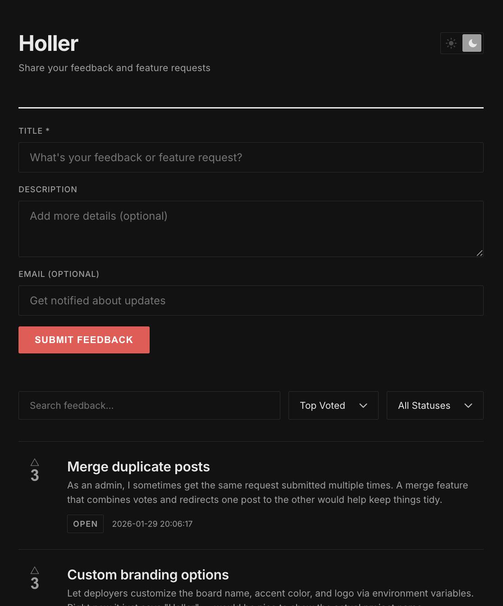

# Holler

Lightweight, open-source feedback board. One-click deploy. Free to run forever.

No servers. No containers. No databases to manage. Runs entirely on Cloudflare's free tier.

[](https://holler-demo.holler-25b.workers.dev) [](https://deploy.workers.cloudflare.com/?url=https://github.com/wassertim/holler)



## Features

- **Voting** -- one vote per visitor
- **Full-text search** powered by SQLite FTS5
- **Status tracking** -- open, planned, in progress, done, closed
- **Admin controls** -- update status and delete posts
- **Spam prevention** -- Cloudflare Turnstile (free)
- **Works without JavaScript** -- progressive enhancement

## How It Works

Holler runs on [Cloudflare Workers](https://workers.cloudflare.com/) with a [D1](https://developers.cloudflare.com/d1/) SQLite database. The UI is server-rendered HTML enhanced with [HTMX](https://htmx.org/) -- no frontend build step, no client framework.

## Deploy

Click the deploy button. Cloudflare provisions everything automatically -- the Worker, the database, and the migrations.

After deploying, optionally configure [Turnstile](https://developers.cloudflare.com/turnstile/) for spam prevention and an admin token for moderation. See the [setup guide](docs/setup.md) for details.

## Local Development

```bash
git clone https://github.com/wassertim/holler.git
cd holler
npm install
npx wrangler d1 migrations apply holler-db --local
npm run dev
```

Opens at `http://localhost:8787`. Turnstile is skipped locally. See the [setup guide](docs/setup.md) for admin access and configuration.

## License

MIT
